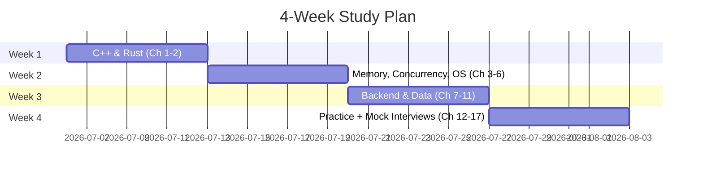

# 📘 C++ / Rust Backend Developer — Interview Prep Book

> A complete study guide for clearing the **Rieter C++/Rust Backend Developer** interview (3–7 yrs level), written for junior developers.

## How to use this book
1. Read parts 1→4 in order. Each chapter ends with **Interview Q&A**.
2. Type every code example yourself — don't copy-paste while learning.
3. Finish with Part 5 (mock questions + exercises) one week before the interview.

> 🦀 **Already a Rust developer?** Take the [Rust Developer Fast Track](rust-track.md) instead — it compresses the C++ requirement into a 1–2 day "C++ through Rust" survival kit and reallocates the saved time to the breadth topics, cutting the plan to 3 weeks.

## Table of Contents

### Part 1 — Core Languages
| Ch | Topic | Why it matters for this JD |
|----|-------|---------------------------|
| 1 | [C++ Fundamentals → Advanced](part1-languages/01-cpp.md) | Essential skill |
| 2 | [Rust Deep Dive](part1-languages/02-rust.md) | Essential skill |
| 3 | [Memory Management & Performance](part1-languages/03-memory.md) | Explicitly required |
| 4 | [Concurrency](part1-languages/04-concurrency.md) | Explicitly required |

### Part 2 — Systems & OS
| Ch | Topic |
|----|-------|
| 5 | [OS Concepts](part2-systems/05-os-concepts.md) |
| 6 | [Linux, Ubuntu & Bash Scripting](part2-systems/06-linux-bash.md) |
| 7 | [Systems Programming](part2-systems/07-systems-programming.md) |

### Part 3 — Backend & Data
| Ch | Topic |
|----|-------|
| 8 | [API Design: REST, SOAP, WebSocket](part3-backend/08-api-design.md) |
| 9 | [Databases: Postgres, MongoDB, MySQL](part3-backend/09-databases.md) |
| 10 | [Messaging: Kafka & RabbitMQ](part3-backend/10-messaging.md) |
| 11 | [Docker & Deployment](part3-backend/11-docker.md) |

### Part 4 — Engineering Practice
| Ch | Topic |
|----|-------|
| 12 | [Testing & QA](part4-practice/12-testing.md) |
| 13 | [SDLC, Git, Jira & Requirements](part4-practice/13-sdlc-git.md) |
| 14 | [Debugging & Tooling](part4-practice/14-debugging-tooling.md) |

### Part 5 — Interview Prep
| Ch | Topic |
|----|-------|
| 15 | [200+ Interview Questions & Answers](part5-interview/15-questions.md) |
| 16 | [Coding Exercises & System Design](part5-interview/16-exercises.md) |
| 17 | [Behavioral Questions & Company Research](part5-interview/17-behavioral.md) |

## Study plan (4 weeks)

