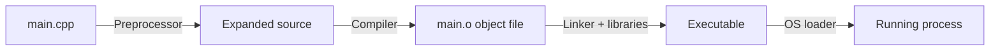
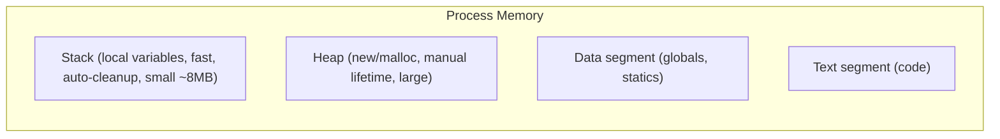
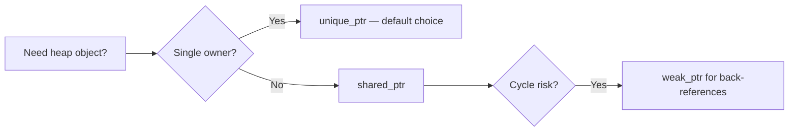
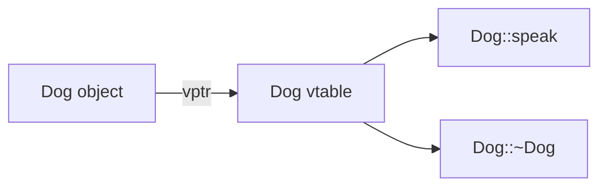

# Chapter 1 — C++ Fundamentals → Advanced

> Goal: answer any C++ question from "what is a pointer" to "explain move semantics" with confidence.

## 1.1 How C++ works (compilation model)

C++ is a **compiled, statically-typed** language. Source code becomes machine code before running:



**Interview line:** "The preprocessor handles `#include`/`#define`, the compiler produces object files per translation unit, and the linker resolves symbols across them into one executable."

## 1.2 Value types, references, pointers

```cpp
int a = 10;
int& ref = a;    // reference: an alias, must be initialized, can't be reseated
int* ptr = &a;   // pointer: holds an address, can be null, can be reassigned

*ptr = 20;       // a is now 20
ref = 30;        // a is now 30
```

| | Reference | Pointer |
|---|---|---|
| Can be null | ❌ | ✅ (`nullptr`) |
| Can be reassigned | ❌ | ✅ |
| Needs dereferencing `*` | ❌ | ✅ |
| Arithmetic | ❌ | ✅ |

**Rule of thumb:** prefer references for function parameters, pointers when "no value" (null) is meaningful or ownership is involved.

## 1.3 Stack vs Heap



```cpp
void f() {
    int x = 5;              // stack — destroyed when f() returns
    int* p = new int(5);    // heap — lives until delete
    delete p;               // forget this = memory leak
}
```

## 1.4 RAII — the most important C++ idea

**RAII (Resource Acquisition Is Initialization):** tie a resource's lifetime to an object's lifetime. Constructor acquires, destructor releases. No leaks even when exceptions are thrown.

```cpp
class FileHandle {
    FILE* f_;
public:
    explicit FileHandle(const char* path) : f_(fopen(path, "r")) {
        if (!f_) throw std::runtime_error("open failed");
    }
    ~FileHandle() { if (f_) fclose(f_); }   // always runs, even on exception
    FILE* get() const { return f_; }
};
```

**Interview line:** "RAII is why modern C++ rarely uses raw `new`/`delete`. `std::string`, `std::vector`, `std::lock_guard`, and smart pointers are all RAII types."

## 1.5 Smart pointers (modern memory management)

```cpp
#include <memory>

// unique_ptr: sole owner, zero overhead, moves only
auto u = std::make_unique<int>(42);
auto u2 = std::move(u);          // ownership transferred, u is now null

// shared_ptr: reference-counted shared ownership
auto s1 = std::make_shared<int>(42);
auto s2 = s1;                    // ref count = 2; freed when count hits 0

// weak_ptr: non-owning observer; breaks shared_ptr cycles
std::weak_ptr<int> w = s1;
if (auto locked = w.lock()) { /* object still alive */ }
```



**Classic question:** *"Why do shared_ptr cycles leak?"* — Two objects holding `shared_ptr` to each other keep counts at 1 forever. Fix: make one direction a `weak_ptr`.

## 1.6 OOP in C++ (the four pillars)

| Pillar | Meaning | C++ mechanism |
|---|---|---|
| **Encapsulation** | Hide internal state | `private`/`public`, getters |
| **Abstraction** | Expose only what's needed | abstract classes, interfaces |
| **Inheritance** | Reuse via is-a relation | `class Dog : public Animal` |
| **Polymorphism** | One interface, many behaviors | `virtual` functions |

```cpp
class Animal {
public:
    virtual ~Animal() = default;          // ALWAYS virtual destructor in base classes!
    virtual std::string speak() const = 0; // pure virtual → abstract class
};

class Dog : public Animal {
public:
    std::string speak() const override { return "Woof"; }
};

void greet(const Animal& a) { std::cout << a.speak(); } // runtime polymorphism
```

**How virtual works:** each polymorphic object holds a hidden **vptr** pointing to its class's **vtable** (array of function pointers). Calls dispatch through it at runtime.



**Trap question:** *"Why must a base class destructor be virtual?"* — Deleting a derived object through a base pointer without a virtual destructor is **undefined behavior**: only the base destructor runs, leaking derived resources.

## 1.7 Constructors & the Rule of Five

If your class manages a resource, define (or delete) all five:

```cpp
class Buffer {
    char* data_; size_t size_;
public:
    Buffer(size_t n) : data_(new char[n]), size_(n) {}
    ~Buffer() { delete[] data_; }                                  // 1 destructor
    Buffer(const Buffer& o)                                        // 2 copy ctor
        : data_(new char[o.size_]), size_(o.size_)
    { std::copy(o.data_, o.data_ + size_, data_); }
    Buffer& operator=(const Buffer& o);                            // 3 copy assign
    Buffer(Buffer&& o) noexcept                                    // 4 move ctor
        : data_(o.data_), size_(o.size_)
    { o.data_ = nullptr; o.size_ = 0; }
    Buffer& operator=(Buffer&& o) noexcept;                        // 5 move assign
};
```

**Rule of Zero (preferred):** use `std::vector`/`std::string`/smart pointers as members so the compiler-generated five are correct and you write none.

## 1.8 const correctness

```cpp
const int c = 5;            // value can't change
const int* p1;              // pointer to const (data immutable via p1)
int* const p2 = &a;         // const pointer (address immutable)
int get() const;            // method that doesn't modify the object
```

**Interview line:** "Read pointer declarations right-to-left: `const int*` is 'pointer to const int'."

## 1.9 static keyword (3 meanings)

1. **In a function** — variable persists across calls, initialized once.
2. **In a class** — member shared by all instances (no `this`).
3. **At file scope** — internal linkage (symbol invisible to other translation units).

## 1.10 Move semantics & rvalue references (C++11)

**Problem:** copying large objects (e.g., a vector with 1M elements) is expensive.
**Solution:** *move* — steal the internals of a temporary instead of copying.

```cpp
std::vector<int> makeBig();            // returns a temporary (rvalue)

std::vector<int> v1 = makeBig();       // move — pointers stolen, O(1)
std::vector<int> v2 = v1;              // copy — all elements duplicated, O(n)
std::vector<int> v3 = std::move(v1);   // force move; v1 is now valid-but-empty
```

- **lvalue** = has a name/address (`v1`). **rvalue** = temporary (`makeBig()`).
- `T&&` binds to rvalues; `std::move(x)` is just a cast to `T&&` — it moves nothing by itself.
- Mark move constructors `noexcept` so `std::vector` uses them during reallocation.

**Trap question:** *"What state is an object in after being moved from?"* — Valid but unspecified. You may assign to it or destroy it, but don't read its value.

## 1.11 STL containers — what to use when

| Container | Backing | Access | Insert/erase | Use when |
|---|---|---|---|---|
| `vector` | dynamic array | O(1) index | O(1) amortized at end | **default choice** |
| `deque` | chunked array | O(1) index | O(1) both ends | queue-like usage |
| `list` | doubly-linked | O(n) | O(1) with iterator | rare; splice-heavy code |
| `map` / `set` | red-black tree | O(log n) | O(log n) | sorted iteration needed |
| `unordered_map` / `unordered_set` | hash table | O(1) avg | O(1) avg | fast lookup, no order |

```cpp
std::unordered_map<std::string, int> counts;
for (const auto& w : words) ++counts[w];      // word frequency in 2 lines

std::vector<int> v{5, 1, 4};
std::sort(v.begin(), v.end());                 // algorithms work on iterators
auto it = std::find(v.begin(), v.end(), 4);
```

**Trap question:** *"When are vector iterators invalidated?"* — On any reallocation (push_back past capacity) or erase at/before the iterator's position.

## 1.12 Templates (generic programming)

```cpp
template <typename T>
T maxOf(T a, T b) { return a > b ? a : b; }    // compiler generates per-type code

template <typename T>
class Stack {
    std::vector<T> data_;
public:
    void push(T v) { data_.push_back(std::move(v)); }
    T pop() { T v = std::move(data_.back()); data_.pop_back(); return v; }
};
```

- Templates are **compile-time**: errors appear at instantiation; no runtime cost (unlike virtual dispatch).
- **Template specialization** lets you customize behavior for a specific type.
- Know the term **SFINAE** / C++20 **concepts** = constraining which types a template accepts.

## 1.13 Exceptions & error handling

```cpp
try {
    riskyOperation();
} catch (const std::runtime_error& e) {   // catch by const reference!
    log(e.what());
    throw;                                 // rethrow preserving type
} catch (...) {                            // catch-all, last resort
}
```

Rules interviewers expect:
- Catch by `const&` (avoids slicing and copies).
- Destructors must **never throw**.
- **Exception safety levels:** basic (no leaks, valid state), strong (commit-or-rollback), nothrow.
- RAII is what makes exception-safe code practical.

## 1.14 Modern C++ quick reference (C++11/14/17)

| Feature | Example | Why |
|---|---|---|
| `auto` | `auto it = m.begin();` | less noise, fewer type bugs |
| range-for | `for (auto& x : v)` | clean iteration |
| lambdas | `[capture](args){ body }` | inline callbacks |
| `nullptr` | replaces `NULL`/`0` | type-safe |
| `constexpr` | compile-time evaluation | zero runtime cost |
| structured bindings (17) | `auto [k, v] = *it;` | readable pair access |
| `std::optional` (17) | maybe-a-value returns | no sentinel values |
| `std::string_view` (17) | non-owning string ref | avoids copies |

```cpp
// Lambda example: sort by absolute value
std::sort(v.begin(), v.end(),
          [](int a, int b) { return std::abs(a) < std::abs(b); });

// Capture: [=] copy all, [&] reference all, [x, &y] mixed
int threshold = 10;
auto over = std::count_if(v.begin(), v.end(),
                          [threshold](int x) { return x > threshold; });
```

---

## 🎯 Chapter 1 Interview Q&A

**Q1. Difference between `new/delete` and `malloc/free`?**
`new` calls constructors and is type-safe; `malloc` only allocates raw bytes. Never mix them (UB).

**Q2. What is object slicing?**
Assigning a derived object to a base *by value* copies only the base part, losing derived data. Avoid by passing by reference/pointer.

**Q3. Stack vs heap allocation — which is faster and why?**
Stack: just a pointer bump, cache-friendly, auto-freed. Heap: allocator bookkeeping, possible fragmentation, manual lifetime.

**Q4. What does `virtual` cost?**
One vptr per object, one indirection per call, and it usually blocks inlining. Use only when runtime polymorphism is needed.

**Q5. `unique_ptr` vs `shared_ptr` overhead?**
`unique_ptr` is zero-overhead (same as raw pointer). `shared_ptr` has a control block with atomic ref counting — measurable cost in hot paths.

**Q6. Why `make_shared` over `shared_ptr<T>(new T)`?**
Single allocation (object + control block together), exception-safe, better cache locality.

**Q7. What is the diamond problem?**
Two base classes share a common ancestor → derived gets two copies. Fixed with `virtual` inheritance.

**Q8. `override` and `final` keywords?**
`override` makes the compiler verify you're actually overriding a virtual (catches signature typos). `final` forbids further overriding/derivation.

**Q9. What is undefined behavior? Give 3 examples.**
Behavior the standard doesn't define; anything may happen. Examples: dereferencing null/dangling pointers, out-of-bounds access, signed integer overflow, use-after-free, data races.

**Q10. `emplace_back` vs `push_back`?**
`emplace_back` constructs the element in place from constructor args, avoiding a temporary + move/copy.

**Q11. What is copy elision / RVO?**
The compiler constructs the return value directly in the caller's storage, skipping copies/moves entirely. Mandatory for prvalues since C++17.

**Q12. When would you still use raw pointers?**
Non-owning observation (function parameter that may be null) — never for ownership in modern code.
