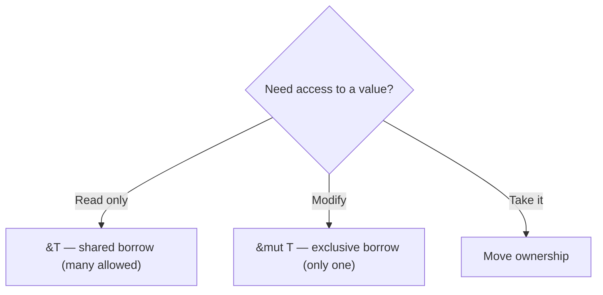
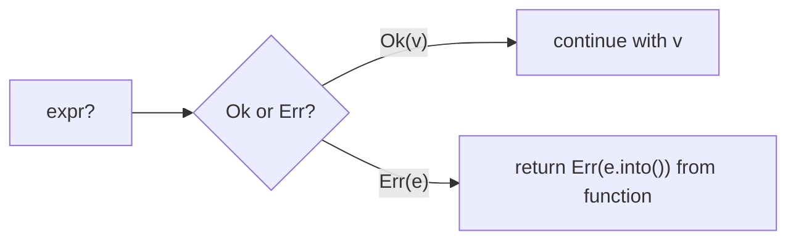

# Chapter 2 — Rust Deep Dive

> Goal: explain ownership, borrowing, lifetimes, and error handling like someone who writes Rust daily. These four topics are ~80% of every Rust interview.

## 2.1 Why Rust? (the elevator answer)

**Interview line:** "Rust gives C++-level performance with compile-time memory safety and data-race freedom — no garbage collector, no runtime cost. The compiler enforces what C++ code reviews hope to catch."

| | C++ | Rust |
|---|---|---|
| Memory safety | Programmer discipline | Compiler-enforced |
| Data races | Possible, hard to find | Compile error |
| Null pointers | `nullptr` crashes | No null — `Option<T>` |
| Error handling | Exceptions / codes | `Result<T, E>` |
| Package manager | None standard | Cargo built-in |

## 2.2 Cargo & tooling (know these cold)

```bash
cargo new myapp          # create project
cargo build --release    # optimized build
cargo run                # build + run
cargo test               # run tests
cargo clippy             # linter — mention this in interviews!
cargo fmt                # formatter
cargo doc --open         # generate docs from /// comments
```

Project layout and config (`Cargo.toml` — note: **TOML**, also in the JD):

```toml
[package]
name = "myapp"
version = "0.1.0"
edition = "2021"

[dependencies]
serde = { version = "1", features = ["derive"] }  # JSON serialization
tokio = { version = "1", features = ["full"] }     # async runtime
```

## 2.3 Ownership — the core rule

**Three rules (memorize verbatim):**
1. Every value has exactly **one owner**.
2. When the owner goes out of scope, the value is **dropped** (freed).
3. Assigning or passing a value **moves** ownership (for non-`Copy` types).

```rust
let s1 = String::from("hello");
let s2 = s1;                 // MOVE: s1 is now invalid
// println!("{}", s1);       // ❌ compile error: value borrowed after move
println!("{}", s2);          // ✅

let x = 5;
let y = x;                   // i32 is Copy — both valid (cheap stack copy)
```

```mermaid
flowchart LR
    subgraph "let s2 = s1 (move)"
        s1[s1 ❌ invalidated] -.-> H[(heap: "hello")]
        s2[s2 ✅ owner] --> H
    end
```

**Why:** exactly one owner → exactly one free → no double-free, no use-after-free, no leaks — all checked at **compile time**.

**Copy vs Move:** simple stack types (`i32`, `f64`, `bool`, `char`, tuples of Copy types) implement `Copy`. Heap-owning types (`String`, `Vec`, `Box`) move.

## 2.4 Borrowing — references without ownership

**The borrowing rule (say it exactly like this):**
> At any time you may have **either any number of immutable references (`&T`) or exactly one mutable reference (`&mut T`)** — never both.

```rust
fn len(s: &String) -> usize { s.len() }        // borrows, doesn't take ownership

let mut s = String::from("hi");
let r1 = &s;
let r2 = &s;              // ✅ many immutable borrows
println!("{} {}", r1, r2); // borrows end here (last use)

let m = &mut s;           // ✅ now one mutable borrow is allowed
m.push_str(" there");
```

```rust
let r = &s;
let m = &mut s;           // ❌ error: cannot borrow mutable while immutable borrow live
println!("{}", r);
```



**Why this rule exists:** "shared XOR mutable" makes data races and iterator invalidation **impossible at compile time**. This is *the* Rust insight interviewers want you to articulate.

**Dangling references are impossible:**
```rust
fn bad() -> &String {                 // ❌ won't compile
    let s = String::from("oops");
    &s                                 // s dies here — compiler rejects
}
fn good() -> String {                  // ✅ move ownership out instead
    String::from("fine")
}
```

## 2.5 Lifetimes — naming how long references live

Lifetimes don't change anything at runtime; they let the compiler **prove** references outlive their use.

```rust
// "the returned reference lives as long as the shorter of x and y"
fn longest<'a>(x: &'a str, y: &'a str) -> &'a str {
    if x.len() > y.len() { x } else { y }
}

// Structs holding references need lifetimes too:
struct Excerpt<'a> {
    part: &'a str,     // Excerpt cannot outlive the string it points into
}
```

- Most of the time **lifetime elision** rules infer them — you only write `'a` when the compiler can't tell which input the output borrows from.
- `'static` = lives for the whole program (string literals, owned leaked data).

**Interview line:** "Lifetimes are compile-time annotations that connect the lifetime of an output reference to its inputs, so the borrow checker can reject dangling references."

## 2.6 Option — no null in Rust

```rust
fn find_user(id: u32) -> Option<String> {
    if id == 1 { Some("alice".to_string()) } else { None }
}

match find_user(1) {
    Some(name) => println!("found {name}"),
    None       => println!("not found"),
}

// Idiomatic shortcuts:
let name = find_user(1).unwrap_or_default();       // default on None
if let Some(name) = find_user(1) { /* ... */ }      // single-case match
let upper = find_user(1).map(|n| n.to_uppercase()); // transform if present
```

**Never say you'd use `.unwrap()` in production code** — say: "I'd pattern match, use combinators like `map`/`unwrap_or`, or propagate with `?`. `unwrap` is for tests and prototypes."

## 2.7 Result & the `?` operator — error handling

```rust
use std::fs;
use std::num::ParseIntError;

fn parse_port(s: &str) -> Result<u16, ParseIntError> {
    s.trim().parse::<u16>()          // returns Result — caller must handle it
}

fn read_port(path: &str) -> Result<u16, Box<dyn std::error::Error>> {
    let text = fs::read_to_string(path)?;   // ? = return Err early, else unwrap Ok
    let port = parse_port(&text)?;           // errors auto-convert via From
    Ok(port)
}
```



- **Recoverable errors** → `Result<T, E>`. **Bugs/unrecoverable** → `panic!`.
- Real projects: **`thiserror`** for defining library error enums, **`anyhow`** for application-level error bubbling. Mentioning these signals real-world experience.

```rust
#[derive(thiserror::Error, Debug)]
enum AppError {
    #[error("config invalid: {0}")]
    Config(String),
    #[error("io failure")]
    Io(#[from] std::io::Error),   // automatic From conversion for ?
}
```

## 2.8 Structs, enums & pattern matching

```rust
struct Machine {                      // like a C++ class (data)
    id: u32,
    rpm: f64,
}

impl Machine {                        // methods live in impl blocks
    fn new(id: u32) -> Self { Self { id, rpm: 0.0 } }
    fn speed(&self) -> f64 { self.rpm }          // &self = const method
    fn set(&mut self, rpm: f64) { self.rpm = rpm; } // &mut self = mutating
}

// Enums are full algebraic data types — each variant can carry data:
enum Command {
    Start,
    SetSpeed(f64),
    Configure { retries: u8, timeout_ms: u64 },
}

fn handle(cmd: Command) {
    match cmd {                        // match must be EXHAUSTIVE
        Command::Start => println!("starting"),
        Command::SetSpeed(rpm) if rpm > 0.0 => println!("speed {rpm}"),
        Command::SetSpeed(_) => println!("invalid speed"),
        Command::Configure { retries, .. } => println!("retries {retries}"),
    }
}
```

**Interview line:** "Rust enums + exhaustive `match` turn forgotten cases into compile errors — `Option` and `Result` are just enums."

## 2.9 Traits — Rust's interfaces

```rust
trait Sensor {
    fn read(&self) -> f64;
    fn unit(&self) -> &str { "unknown" }   // default method
}

struct TempSensor;
impl Sensor for TempSensor {
    fn read(&self) -> f64 { 21.5 }
    fn unit(&self) -> &str { "°C" }
}

// STATIC dispatch — generics, monomorphized, zero cost (like C++ templates):
fn log_static<T: Sensor>(s: &T) { println!("{} {}", s.read(), s.unit()); }

// DYNAMIC dispatch — trait object, vtable at runtime (like C++ virtual):
fn log_dyn(s: &dyn Sensor) { println!("{} {}", s.read(), s.unit()); }
let sensors: Vec<Box<dyn Sensor>> = vec![Box::new(TempSensor)];
```

| | `impl Trait` / generics | `dyn Trait` |
|---|---|---|
| Dispatch | compile time (monomorphization) | runtime (vtable) |
| Cost | zero, but bigger binary | pointer indirection |
| Heterogeneous collections | ❌ | ✅ |

Derive common traits instead of writing them: `#[derive(Debug, Clone, PartialEq, Default)]`.

**Key traits to know:** `Debug`, `Clone`, `Copy`, `Default`, `PartialEq/Eq`, `Hash`, `Iterator`, `From/Into`, `Drop` (destructor — Rust's RAII), `Send`/`Sync` (thread safety markers, see Ch 4).

## 2.10 Collections & iterators

```rust
let v = vec![1, 2, 3, 4, 5];
let sum_sq: i32 = v.iter()
    .filter(|&&x| x % 2 == 0)
    .map(|&x| x * x)
    .sum();                                  // lazy, fused, zero-cost

use std::collections::HashMap;
let mut counts: HashMap<&str, i32> = HashMap::new();
for w in ["a", "b", "a"] {
    *counts.entry(w).or_insert(0) += 1;      // the entry API — idiomatic
}
```

- `iter()` borrows, `iter_mut()` borrows mutably, `into_iter()` consumes.
- `String` vs `&str`: owned, growable, heap vs borrowed slice view. Functions should take `&str` parameters.

## 2.11 Smart pointers & interior mutability

| Type | Purpose | C++ analogue |
|---|---|---|
| `Box<T>` | heap allocation, single owner | `unique_ptr` |
| `Rc<T>` | ref-counted sharing (single thread) | `shared_ptr` (no atomics) |
| `Arc<T>` | atomic ref-counted sharing (threads) | `shared_ptr` |
| `RefCell<T>` | borrow rules checked at **runtime** | — |
| `Mutex<T>` | lock that owns its data | mutex + data (enforced!) |

```rust
use std::rc::Rc;
use std::cell::RefCell;

let shared = Rc::new(RefCell::new(vec![1, 2]));
let clone = Rc::clone(&shared);          // ref count -> 2
clone.borrow_mut().push(3);              // runtime-checked mutable borrow
assert_eq!(shared.borrow().len(), 3);
```

**Trap question:** *"What happens if you violate RefCell rules?"* — It **panics at runtime** (borrow checking moved from compile time to runtime). And `Rc` cycles leak, same as `shared_ptr` — use `Weak`.

## 2.12 Modules & crates (project organization)

```rust
// src/lib.rs
pub mod sensors;              // loads src/sensors.rs or src/sensors/mod.rs

// src/sensors.rs
pub struct Reader;            // pub = visible outside the module
pub(crate) fn helper() {}     // visible within this crate only

// elsewhere
use crate::sensors::Reader;
```

- **Crate** = compilation unit (binary or library). **Module** = namespace within a crate. **Package** = Cargo.toml + one or more crates.

---

## 🎯 Chapter 2 Interview Q&A

**Q1. Explain ownership in one breath.**
Each value has one owner; when the owner leaves scope the value is dropped; assignment moves ownership. This gives deterministic, compile-time-verified memory management without a GC.

**Q2. What problem does the borrow checker solve?**
Use-after-free, double-free, dangling pointers, iterator invalidation, and data races — all rejected at compile time via the "many readers XOR one writer" rule.

**Q3. `String` vs `&str`?**
`String` is an owned, heap-allocated, growable buffer. `&str` is a borrowed view (pointer + length) into string data. Accept `&str` in APIs, return `String` when you create data.

**Q4. When do you need explicit lifetimes?**
When a function returns a reference and the compiler can't infer which input it borrows from, or when a struct stores references.

**Q5. `Box` vs `Rc` vs `Arc`?**
`Box`: single owner, heap. `Rc`: shared ownership, non-atomic count, single-threaded. `Arc`: atomic count, safe to share across threads (usually as `Arc<Mutex<T>>`).

**Q6. How is Rust error handling different from C++ exceptions?**
Errors are values (`Result`), visible in signatures, and impossible to silently ignore (`#[must_use]`). No hidden control flow, no unwinding surprises; `?` keeps it ergonomic.

**Q7. What is `panic!` and when is it OK?**
Unrecoverable-bug handling (unwinds or aborts). OK in tests and for broken invariants; never for expected failures like bad user input — use `Result`.

**Q8. Static vs dynamic dispatch in Rust?**
Generics monomorphize at compile time (zero cost, like templates); `dyn Trait` uses a vtable (like C++ virtual). Use `dyn` for heterogeneous collections or smaller binaries.

**Q9. What does `#[derive(Clone)]` do and how is `Clone` different from `Copy`?**
Generates a deep-copy `clone()` method. `Copy` is an implicit cheap bitwise copy for stack-only types; `Clone` is explicit and may allocate.

**Q10. Why can't you have two mutable references?**
Exclusive mutation prevents data races and aliasing bugs — the compiler can prove no one observes a half-updated value.

**Q11. What is `Drop`?**
Rust's destructor trait — RAII exactly like C++: files close, locks release, memory frees when owners go out of scope, in reverse declaration order.

**Q12. What is unsafe Rust?**
An escape hatch (`unsafe {}`) allowing raw pointer dereference, FFI calls, etc. The compiler still checks everything else; you take responsibility for upholding the invariants. Idiomatic code wraps unsafe in small, audited, safe APIs.
