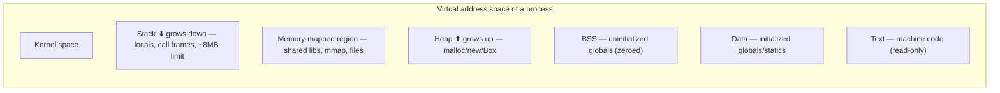
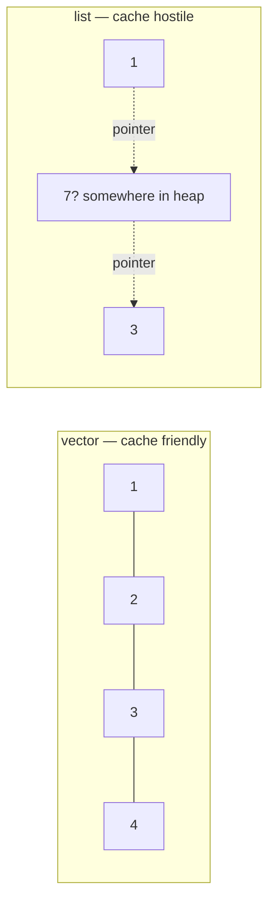

# Chapter 3 — Memory Management & Performance Optimization

> The JD explicitly lists "memory management" and "performance optimization". Expect deep questions here — this chapter connects C++, Rust, and the hardware underneath.

## 3.1 Process memory layout (draw this in interviews)



Each function call pushes a **stack frame** (return address, saved registers, locals). Recursion too deep → **stack overflow**.

## 3.2 The four memory bugs (and how each language handles them)

| Bug | What happens | C++ defense | Rust defense |
|---|---|---|---|
| **Leak** | memory never freed | RAII, smart pointers | ownership (Drop) — leaks still possible via `Rc` cycles |
| **Use-after-free** | read/write freed memory | discipline + sanitizers | borrow checker (compile error) |
| **Double free** | free twice → heap corruption | smart pointers | move semantics (compile error) |
| **Buffer overflow** | write past bounds | `.at()`, bounds discipline | bounds-checked indexing (panic, not corruption) |

```cpp
// C++: classic use-after-free
int* p = new int(5);
delete p;
*p = 7;                   // UB — may "work", may crash, may corrupt
```

```rust
// Rust: the equivalent simply doesn't compile
let v = vec![1, 2, 3];
let r = &v[0];
drop(v);                  // ❌ error: cannot move `v` while borrowed
println!("{r}");
```

## 3.3 Finding memory bugs — tooling (JD keyword: Tooling)

```bash
# Valgrind — detects leaks, invalid reads/writes (slow, ~20x)
valgrind --leak-check=full ./myapp

# AddressSanitizer — compile-in, ~2x slowdown, great in CI
g++ -fsanitize=address -g main.cpp && ./a.out

# Other sanitizers to name-drop:
#   -fsanitize=undefined   (UB detection)
#   -fsanitize=thread      (data races)
#   -fsanitize=leak        (leaks only, fast)
```

**Interview line:** "In C++ CI I run tests under AddressSanitizer and UBSan; Valgrind for deeper hunts. In Rust most of these bugs are compile errors, and I use Miri for unsafe code."

## 3.4 Why cache matters more than big-O constants

Approximate latencies (memorize the ratios, not exact numbers):

| Access | Cost | Relative |
|---|---|---|
| L1 cache | ~1 ns | 1× |
| L2 cache | ~4 ns | 4× |
| L3 cache | ~30 ns | 30× |
| RAM | ~100 ns | 100× |
| SSD | ~100 µs | 100,000× |

CPUs fetch memory in **64-byte cache lines**. Sequential access → the prefetcher wins; pointer chasing → cache miss per hop.



**This is why `vector` beats `list` almost always**, even for middle insertion in small/medium sizes — a favorite interview discussion.

## 3.5 Struct layout, alignment & padding

The compiler inserts padding so each field sits at its aligned address:

```cpp
struct Bad  { char a; double b; char c; };  // 1+7pad+8+1+7pad = 24 bytes
struct Good { double b; char a; char c; };  // 8+1+1+6pad     = 16 bytes
```

**Rule:** order fields largest-first to minimize padding. In Rust, the compiler reorders fields automatically (`repr(Rust)`); use `#[repr(C)]` for FFI-stable layout.

## 3.6 Allocation cost & how to avoid it

Heap allocation involves locks/bookkeeping in the allocator. In hot paths, **the fastest allocation is none**:

```cpp
// 1. Reserve capacity — avoid repeated reallocation+copy
std::vector<int> v;
v.reserve(10'000);                 // one allocation instead of ~14

// 2. Reuse buffers across iterations
std::string line;
while (std::getline(file, line)) { /* line's capacity is reused */ }

// 3. Avoid accidental copies
for (const auto& item : big_items) { }   // & — without it, copy per element!

// 4. Small String Optimization: short std::strings avoid the heap entirely
```

```rust
// Rust equivalents
let mut v = Vec::with_capacity(10_000);
let mut buf = String::new();
reader.read_line(&mut buf)?;   // reuse
buf.clear();
```

Name-drop for senior points: **arena/pool allocators** (allocate once, bump-allocate inside, free all at once) for many small short-lived objects.

## 3.7 The optimization workflow (never skip step 1)


**Interview line:** "I never optimize without profiling first — intuition about hotspots is usually wrong." (Interviewers love this sentence.)

Tools to know:
```bash
perf record -g ./myapp && perf report   # Linux CPU profiler
# flamegraphs — visualize where time goes
cargo flamegraph                        # Rust one-liner
hyperfine './a.out'                     # CLI benchmarking
cargo bench                             # + criterion crate for statistical rigor
```

Always benchmark **release builds**: `g++ -O2` / `cargo build --release`. Debug-build benchmarks are meaningless.

## 3.8 Common optimizations checklist (ranked by typical payoff)

1. **Better algorithm/data structure** — O(n²)→O(n log n) beats any micro-tuning.
2. **Fewer allocations** — reserve, reuse, arenas.
3. **Cache-friendly layout** — contiguous data, iterate sequentially, Structure-of-Arrays for bulk numeric processing.
4. **Avoid copies** — pass by `const&`/`&str`, move semantics, `string_view`.
5. **Batch work / reduce syscalls** — buffered I/O instead of per-byte writes.
6. **Parallelism** — only after single-thread efficiency (see Ch 4); in Rust, `rayon` makes `.par_iter()` trivial.
7. **Micro-level** — branch prediction friendliness, inlining, SIMD. Mention these last.

## 3.9 Zero-cost abstractions (the phrase to use)

Both C++ and Rust promise: *what you don't use, you don't pay for; what you do use, you couldn't hand-code faster.*

```rust
// This iterator chain...
let s: i32 = v.iter().map(|x| x * 2).filter(|x| x > &10).sum();
// ...compiles to the same machine code as a hand-written loop (often auto-vectorized).
```

Exceptions to "zero cost": virtual/`dyn` dispatch, `shared_ptr`/`Arc` atomic counting, bounds checks in Rust indexing (often optimized away; iterators avoid them entirely).

---

## 🎯 Chapter 3 Interview Q&A

**Q1. What is a memory leak and how do you find one?**
Allocated memory that's unreachable but never freed; process RSS grows over time. Find with Valgrind/ASan (`-fsanitize=leak`), or heap profilers. Prevent with RAII/ownership.

**Q2. Why is `std::vector` usually faster than `std::list` even for insertions?**
Contiguous memory → cache hits and prefetching; `list` does a heap allocation per node and pointer-chases across memory. The O(1) insert loses to cache misses until n is large.

**Q3. What is memory fragmentation?**
Free heap memory split into small non-contiguous chunks so large allocations fail despite enough total free space. Mitigate with pools/arenas and fewer allocation size classes.

**Q4. What is data alignment and why does it exist?**
Types must sit at addresses divisible by their alignment for efficient (on some CPUs, correct) access. Compilers add padding; order fields largest-first to reduce it.

**Q5. How would you speed up a slow service? (open question)**
Profile first (perf/flamegraph) → identify hotspot → check algorithm → check allocations and copies → check I/O batching → only then micro-optimize or parallelize → re-measure each change.

**Q6. Stack overflow vs heap exhaustion?**
Stack overflow: exceeding the fixed stack (deep recursion, huge locals) → immediate crash. Heap exhaustion: allocator can't get memory → `bad_alloc`/null/OOM-killer.

**Q7. Does Rust prevent memory leaks?**
No — leaks are safe (not UB). `Rc`/`Arc` cycles and `mem::forget` can leak. Rust prevents *unsafety*: use-after-free, double free, data races.

**Q8. What is false sharing?**
Two threads write different variables that share one cache line → the line ping-pongs between cores, destroying performance. Fix: pad/align per-thread data to 64 bytes. (More in Ch 4.)

**Q9. What's the difference between RSS and virtual memory of a process?**
Virtual = address space reserved; RSS = pages actually resident in RAM. A big mmap can raise virtual size without using physical memory.

**Q10. Why must benchmarks use release builds?**
Debug builds skip optimization (no inlining, extra checks); relative performance of code patterns changes completely under `-O2`, so debug measurements mislead.
