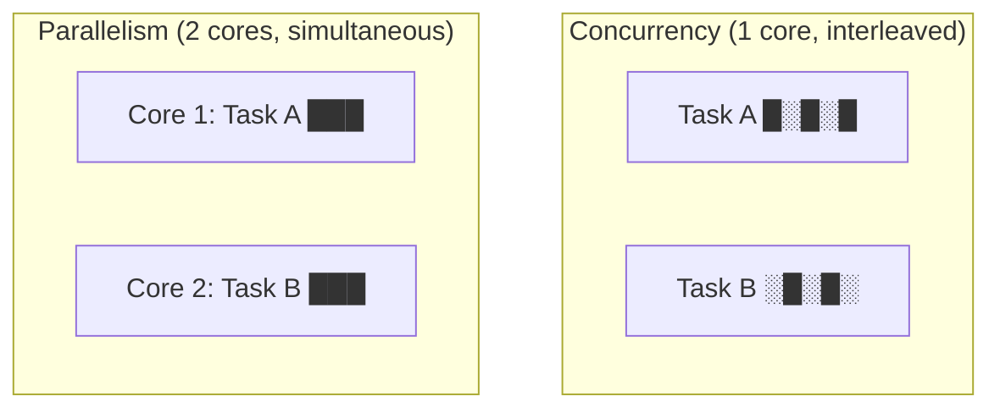
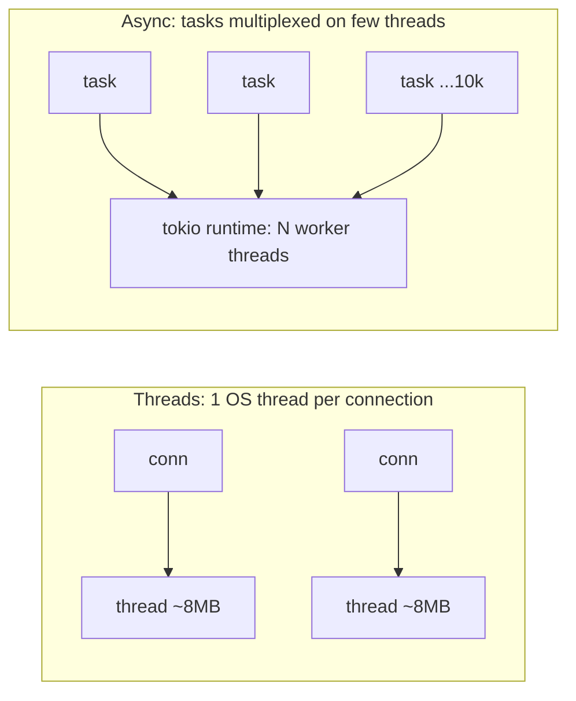

# Chapter 4 — Concurrency (C++ & Rust)

> Explicit JD requirement. Interviewers test: threads vs async, data races, deadlocks, and how Rust makes concurrency safe.

## 4.1 Concurrency vs parallelism (define both, always)

- **Concurrency**: structuring a program to handle many tasks *in progress* at once (may interleave on one core).
- **Parallelism**: literally executing at the same instant on multiple cores.



**When to use what:** CPU-bound work → threads/parallelism. I/O-bound work (many sockets, DB calls) → async or thread pools.

## 4.2 Data race vs race condition (classic trap)

- **Data race**: two threads access the same memory, at least one writes, no synchronization → **undefined behavior** in C++, **compile error** in safe Rust.
- **Race condition**: broader logic bug where correctness depends on timing (can exist even with no data race, e.g., check-then-act on a file).

```cpp
// C++ data race — compiles fine, result is garbage
int counter = 0;
void work() { for (int i = 0; i < 100000; ++i) ++counter; }  // ⚠️ UB
// ++counter is read-modify-write: two threads interleave and lose updates
```

## 4.3 C++ threading essentials

```cpp
#include <thread>
#include <mutex>
#include <atomic>

std::mutex m;
int shared = 0;

void safe_work() {
    for (int i = 0; i < 100000; ++i) {
        std::lock_guard<std::mutex> lk(m);   // RAII lock — unlocks on scope exit
        ++shared;
    }
}

// For a simple counter, atomics are cheaper than a mutex:
std::atomic<int> acounter{0};
void atomic_work() { for (int i = 0; i < 100000; ++i) acounter.fetch_add(1); }

int main() {
    std::thread t1(safe_work), t2(safe_work);
    t1.join(); t2.join();                    // ALWAYS join (or detach)
}
```

Key types to know:
| Type | Use |
|---|---|
| `std::thread` / `std::jthread` (C++20) | spawn threads (`jthread` auto-joins) |
| `std::mutex` + `std::lock_guard` | basic mutual exclusion |
| `std::unique_lock` | lock you can unlock early / use with condvars |
| `std::scoped_lock` | lock **multiple** mutexes deadlock-free |
| `std::condition_variable` | sleep until a condition holds |
| `std::atomic<T>` | lock-free counters/flags |
| `std::async` / `std::future` | run a task, get result later |

### Producer–consumer with condition_variable (know by heart)

```cpp
std::queue<int> q;
std::mutex m;
std::condition_variable cv;

void producer(int v) {
    { std::lock_guard<std::mutex> lk(m); q.push(v); }
    cv.notify_one();
}

int consumer() {
    std::unique_lock<std::mutex> lk(m);
    cv.wait(lk, [] { return !q.empty(); });  // predicate guards spurious wakeups!
    int v = q.front(); q.pop();
    return v;
}
```

## 4.4 Deadlock — the 4 conditions and the fixes

Deadlock needs all four: **mutual exclusion, hold-and-wait, no preemption, circular wait.** Break any one to prevent it.


**Practical fixes (say all three):**
1. **Lock ordering** — always acquire locks in the same global order.
2. `std::scoped_lock(m1, m2)` — acquires both atomically (deadlock-avoidance algorithm).
3. Reduce lock scope / prefer message passing over shared state.

## 4.5 Rust concurrency — "fearless" and why

Rust's borrow rules extend across threads via two **marker traits**:
- **`Send`**: type can be *moved* to another thread.
- **`Sync`**: `&T` can be *shared* between threads.

The compiler rejects sending non-thread-safe data across threads. **A data race in safe Rust is a compile error, not a runtime bug.**

```rust
use std::sync::{Arc, Mutex};
use std::thread;

fn main() {
    let counter = Arc::new(Mutex::new(0));   // shared ownership + lock
    let mut handles = vec![];

    for _ in 0..4 {
        let c = Arc::clone(&counter);
        handles.push(thread::spawn(move || {
            for _ in 0..100_000 {
                *c.lock().unwrap() += 1;     // lock() returns a guard (RAII)
            }
        }));
    }
    for h in handles { h.join().unwrap(); }
    println!("{}", *counter.lock().unwrap()); // exactly 400000, guaranteed
}
```

**Key insight to say out loud:** "In Rust, `Mutex<T>` *owns* the data it protects — you physically cannot touch the data without locking. In C++ the mutex and data are associated only by convention."

### Channels — share by communicating

```rust
use std::sync::mpsc;   // multi-producer, single-consumer
use std::thread;

let (tx, rx) = mpsc::channel();
for id in 0..3 {
    let tx = tx.clone();
    thread::spawn(move || tx.send(format!("worker {id} done")).unwrap());
}
drop(tx);                          // close channel so the loop ends
for msg in rx { println!("{msg}"); }
```

### Data parallelism in one line — rayon

```rust
use rayon::prelude::*;
let sum: u64 = data.par_iter().map(expensive).sum();  // work-stealing thread pool
```

## 4.6 Async Rust (tokio) — for I/O-heavy backends

Threads cost ~MBs of stack each; async tasks cost ~bytes. For 10k concurrent connections (WebSocket servers — see Ch 8), async wins.

```rust
use tokio::net::TcpListener;
use tokio::io::{AsyncReadExt, AsyncWriteExt};

#[tokio::main]
async fn main() -> std::io::Result<()> {
    let listener = TcpListener::bind("0.0.0.0:8080").await?;
    loop {
        let (mut socket, _) = listener.accept().await?;
        tokio::spawn(async move {                 // lightweight task, not a thread
            let mut buf = [0u8; 1024];
            while let Ok(n) = socket.read(&mut buf).await {
                if n == 0 { break; }
                let _ = socket.write_all(&buf[..n]).await;
            }
        });
    }
}
```

How it works (interview version):
- `async fn` compiles to a **state machine** (a `Future`). It does nothing until **polled**.
- The **runtime** (tokio) schedules thousands of futures onto a small thread pool; at every `.await` the task yields so others can run.
- **Rule:** never block (heavy CPU work, `std::thread::sleep`) inside async — use `spawn_blocking` for that.



## 4.7 Atomics & memory ordering (one level deeper)

- CPUs and compilers reorder memory operations; atomics constrain this.
- Orderings: `Relaxed` (counter only, no ordering), `Acquire`/`Release` (publish data between threads — the lock pattern), `SeqCst` (global order, default & safest).

```rust
use std::sync::atomic::{AtomicBool, Ordering};
static READY: AtomicBool = AtomicBool::new(false);
// writer: prepare data, then READY.store(true, Ordering::Release);
// reader: while !READY.load(Ordering::Acquire) {} // then data is visible
```

**Safe interview answer:** "I default to `SeqCst` or mutexes, and reach for Acquire/Release only in measured hot paths — lock-free code is easy to get subtly wrong."

## 4.8 Practical guidance table

| Situation | Reach for |
|---|---|
| CPU-bound batch work | thread pool / `rayon` |
| Many concurrent I/O connections | async (tokio) |
| Shared counter/flag | atomic |
| Shared complex state | `Arc<Mutex<T>>` / `Arc<RwLock<T>>` (many readers) |
| Pipeline between stages | channels (mpsc / crossbeam) |
| Avoiding shared state entirely | message passing — best default |

---

## 🎯 Chapter 4 Interview Q&A

**Q1. Process vs thread?**
Process: own address space, isolated, expensive to create/switch. Thread: shares the process's memory, cheap, but shared state needs synchronization. (Details in Ch 5.)

**Q2. What is a data race and what does the standard say?**
Unsynchronized concurrent access with at least one write. C++: undefined behavior. Safe Rust: rejected at compile time via `Send`/`Sync` and the borrow checker.

**Q3. Mutex vs atomic — when each?**
Atomic: single-word operations (counters, flags), lock-free, cheapest. Mutex: protecting multi-step invariants or larger structures. Wrong to use several atomics where one mutex-protected struct keeps invariants consistent.

**Q4. Explain deadlock and how you'd prevent it.**
Circular wait on locks. Prevent: consistent lock ordering, acquire together (`std::scoped_lock`), keep critical sections tiny, prefer channels/message passing.

**Q5. What are spurious wakeups?**
A condition variable may wake without a notify. Always wait in a loop / with a predicate: `cv.wait(lk, []{ return cond; })`.

**Q6. Why is Rust concurrency called "fearless"?**
Ownership + `Send`/`Sync` make data races compile errors. `Mutex<T>` owns its data so unlocked access is impossible. Refactoring threaded code can't silently introduce races.

**Q7. Threads vs async — tradeoffs?**
Threads: simple model, good for CPU-bound, ~MB stack each, OS context switches. Async: thousands of cheap tasks for I/O-bound loads, but colored functions (`async` propagates) and you must not block the runtime.

**Q8. What is `Arc<Mutex<T>>` and why both?**
`Arc` gives shared *ownership* across threads (atomic refcount); `Mutex` gives synchronized *access*. Ownership and synchronization are separate concerns.

**Q9. What is thread starvation?**
A thread never gets the resources/lock it needs (unfair scheduling, writer starvation with RwLock readers). Mitigate with fair locks, bounded work, avoiding long critical sections.

**Q10. What is false sharing and the fix?**
Independent variables on the same 64-byte cache line written by different cores → the line bounces between cores. Fix: pad/align per-thread data (`alignas(64)` / `#[repr(align(64))]`).

**Q11. `join` vs `detach` in C++?**
`join` blocks until the thread finishes; `detach` lets it run independently (dangerous: it may outlive data it references). Destroying a joinable `std::thread` without either calls `std::terminate`. C++20 `jthread` joins automatically.

**Q12. How does an async function actually run?**
It compiles to a state-machine Future; the runtime polls it; at each `.await` it yields if not ready and is woken by the reactor (epoll/io_uring events) when I/O completes.
