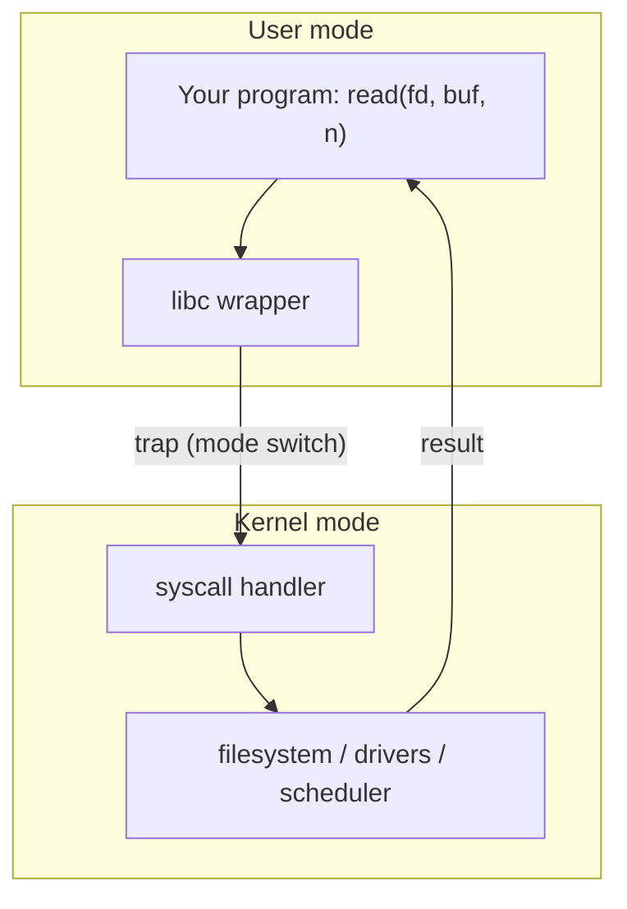
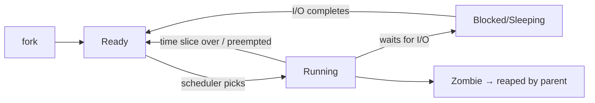
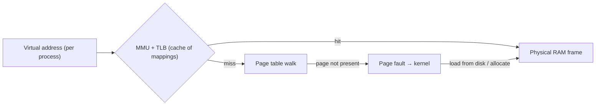

# Chapter 5 — OS Concepts

> Explicit JD requirement ("OS concepts"). For a systems role, expect questions on processes, scheduling, virtual memory, and IPC — usually with "how would you see this on Linux?" follow-ups.

## 5.1 Kernel mode vs user mode & system calls

The CPU runs in two privilege levels. Applications run in **user mode**; only the **kernel** touches hardware, memory maps, and other processes. Programs request kernel services via **system calls**.



- Syscalls are **expensive** (~100s of ns: mode switch, cache effects) → this is why buffered I/O and batching matter (Ch 3).
- See a process's syscalls live: `strace ./myapp` — great debugging tool to name.

## 5.2 Processes

A **process** = a running program: its own virtual address space, file descriptor table, PID, credentials. The kernel tracks each in a **process control block (PCB)**.

### Process lifecycle on Linux



```c
pid_t pid = fork();          // clone the calling process
if (pid == 0) {
    execvp("ls", args);      // child: replace image with a new program
} else {
    waitpid(pid, &status, 0); // parent: wait, reaping the child
}
```

- **fork()** duplicates the process (copy-on-write — pages shared until written).
- **exec()** replaces the process image. `fork+exec` is how shells launch commands.
- **Zombie**: exited child whose parent hasn't `wait()`ed — only a PCB entry remains. **Orphan**: parent died → child re-parented to init/systemd.

## 5.3 Threads vs processes (the table interviewers expect)

| | Process | Thread |
|---|---|---|
| Address space | own | shared with siblings |
| Creation cost | high (fork) | low |
| Context switch | expensive (TLB flush) | cheaper (same memory map) |
| Isolation | crash doesn't kill others | one crash kills the process |
| Communication | IPC needed | shared memory (needs sync, Ch 4) |

## 5.4 CPU scheduling

The scheduler decides which ready thread runs on each core. **Preemptive** scheduling: the kernel interrupts a running thread when its **time slice** expires.

Concepts to know by name:
- **Context switch**: save registers/program counter of one thread, load another's. Cost: microseconds + cache/TLB pollution (the real cost).
- **Linux CFS** (Completely Fair Scheduler): gives each runnable task a fair share of CPU using virtual runtime (replaced by EEVDF in newer kernels — fine to mention either).
- **nice value** (-20..19): priority hint; `nice`/`renice` commands.
- **I/O-bound vs CPU-bound**: I/O-bound tasks sleep often and get scheduled quickly when ready; CPU-bound tasks consume full slices.

## 5.5 Virtual memory & paging (high-value topic)

Every process sees a private, contiguous address space; the MMU maps virtual pages (typically **4KB**) to physical frames via **page tables**.



Why virtual memory exists (say all four):
1. **Isolation** — processes can't touch each other's memory.
2. **Overcommit/lazy allocation** — pages materialize on first touch.
3. **Swapping** — inactive pages can go to disk.
4. **Sharing** — shared libraries mapped once, copy-on-write for fork.

Key terms: **page fault** (minor = just map it; major = read from disk, slow), **TLB** (translation cache; flushes make context switches costly), **thrashing** (constant swapping → system crawls), **OOM killer** (Linux kills a process when memory is exhausted — check `dmesg`).

## 5.6 IPC — inter-process communication (know the menu)

| Mechanism | What | Typical use |
|---|---|---|
| **Pipe** `\|` | one-way byte stream, related processes | shell pipelines |
| **Named pipe (FIFO)** | pipe with a filesystem name | unrelated processes, same host |
| **Unix domain socket** | bidirectional, fast, local | DBs (Postgres!), Docker daemon |
| **TCP socket** | bidirectional, networked | services, APIs (Ch 7–8) |
| **Shared memory** (`shm`/`mmap`) | fastest — no copies | high-throughput, needs sync |
| **Signals** | async notifications (SIGTERM, SIGKILL) | shutdown, control |
| **Message queues** | kernel-managed messages | legacy; today → RabbitMQ/Kafka (Ch 10) |

**Signals every backend dev must know:** `SIGTERM` (polite shutdown — handle it to close connections cleanly; Docker sends this on `stop`), `SIGKILL` (cannot be caught), `SIGSEGV` (invalid memory access), `SIGINT` (Ctrl+C).

## 5.7 File descriptors & everything-is-a-file

- An **fd** is a small integer indexing the process's open-file table: files, sockets, pipes all use `read`/`write`/`close`.
- `0` = stdin, `1` = stdout, `2` = stderr (this is why `2>&1` works — Ch 6).
- fd limits (`ulimit -n`) matter for servers with many connections.
- **I/O multiplexing**: `select`/`poll`/**`epoll`** let one thread wait on thousands of fds — the mechanism under tokio/nginx/Node (connects to Ch 4 async).

## 5.8 Where to observe all this on Linux (Ubuntu)

```bash
ps aux, top, htop          # processes, CPU, memory
free -h                    # RAM & swap
vmstat 1                   # paging, context switches per second
cat /proc/<pid>/status     # one process's memory, threads, state
lsof -p <pid>              # open file descriptors
strace -p <pid>            # live syscalls
dmesg | grep -i oom        # was something OOM-killed?
```

---

## 🎯 Chapter 5 Interview Q&A

**Q1. What happens when you run `./myapp`?**
Shell forks; child execs the binary; kernel loader maps text/data segments and the dynamic linker maps shared libraries; stack/heap set up; `main` runs; on exit, parent reaps the status.

**Q2. Process vs thread — when would you pick processes?**
When isolation matters (crash containment, security) or components are deployed separately. Threads when sharing large state cheaply matters.

**Q3. What is a context switch and why is it expensive?**
Saving one task's CPU state and loading another's. Direct cost is small; real cost is cache/TLB pollution afterward. Excessive switches (`vmstat` cs column) indicate oversubscription.

**Q4. What is a page fault? Are they always bad?**
Access to a page not currently mapped. Minor faults (first-touch allocation, COW) are normal; major faults (read from disk/swap) are slow — many of them means memory pressure.

**Q5. What is copy-on-write?**
After fork, parent and child share physical pages marked read-only; the first write triggers a fault and the kernel copies that page. Makes fork cheap.

**Q6. How does a zombie process happen and how do you fix it?**
Child exits, parent never calls `wait()`. Fix the parent (wait/SIGCHLD handler). Zombies hold only a PCB slot but can exhaust the PID space.

**Q7. Which IPC is fastest and what's the catch?**
Shared memory — zero copies. Catch: you must add synchronization (semaphores/mutexes in shared memory) yourself.

**Q8. What is epoll and why do servers use it?**
An event notification interface: register thousands of sockets, get back only the ready ones. O(ready) instead of O(all) like select/poll — the basis of the C10K solution and async runtimes.

**Q9. SIGTERM vs SIGKILL?**
SIGTERM is catchable — apps should trap it for graceful shutdown (finish requests, flush, close DB connections). SIGKILL can't be caught; the kernel just destroys the process. Docker/K8s send TERM, wait a grace period, then KILL.

**Q10. What is thrashing?**
Working set exceeds RAM → the system spends its time swapping pages in and out instead of executing. Symptoms: high major faults, disk busy, CPU idle. Fix: less memory use, more RAM, fewer processes.

**Q11. What is the difference between `mmap` and `read` for file I/O?**
`read` copies data into your buffer via the kernel; `mmap` maps file pages into the address space — access is a memory load, great for random access to large files and sharing between processes.

**Q12. How would you investigate a server whose memory keeps growing?**
Confirm with `free`/`top`/RSS trend → identify process → `/proc/<pid>/status`, heap profiler or Valgrind/ASan in staging (Ch 3) → check for leak patterns (unbounded caches/queues) → fix and monitor.
