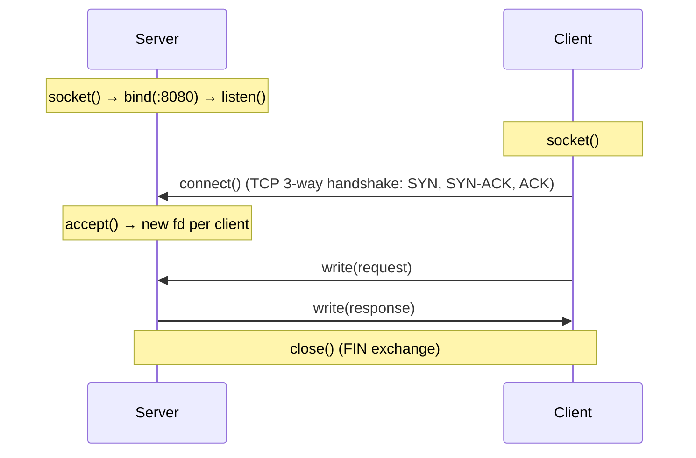
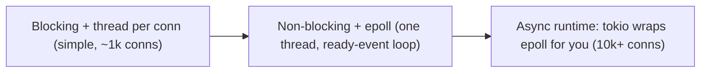

# Chapter 7 — Systems Programming

> JD requirement: "Systems Programming". This means working close to the OS: file I/O, sockets, signals, and calling C from Rust (FFI). Builds directly on Ch 5.

## 7.1 File I/O — from syscall to buffered wrapper

Raw POSIX (C):

```c
#include <fcntl.h>
#include <unistd.h>

int fd = open("data.bin", O_RDONLY);
if (fd < 0) { perror("open"); return 1; }   // errno tells you why

char buf[4096];
ssize_t n;
while ((n = read(fd, buf, sizeof buf)) > 0) {
    write(STDOUT_FILENO, buf, n);           // read may return LESS than asked!
}
close(fd);                                   // always close — fds are finite
```

**Key points interviewers check:**
- `read`/`write` are **syscalls** (expensive, Ch 5) and may transfer *fewer bytes than requested* — always loop.
- Buffered layers (`FILE*`/`fread`, C++ `ifstream`, Rust `BufReader`) batch small reads into few syscalls.
- `errno` + `perror`/`strerror` for error details; check every return value.

Rust equivalent — errors are enforced by the type system:

```rust
use std::fs::File;
use std::io::{BufReader, BufRead};

fn count_lines(path: &str) -> std::io::Result<usize> {
    let f = File::open(path)?;              // Result — can't ignore failure
    Ok(BufReader::new(f).lines().count())    // file closes automatically (Drop/RAII)
}
```

## 7.2 TCP sockets — the lifecycle (memorize this diagram)



Minimal TCP echo server in Rust (std, blocking):

```rust
use std::net::TcpListener;
use std::io::{Read, Write};

fn main() -> std::io::Result<()> {
    let listener = TcpListener::bind("0.0.0.0:8080")?;
    for stream in listener.incoming() {
        let mut s = stream?;
        std::thread::spawn(move || {
            let mut buf = [0u8; 1024];
            while let Ok(n) = s.read(&mut buf) {
                if n == 0 { break; }                 // 0 = peer closed
                if s.write_all(&buf[..n]).is_err() { break; }
            }
        });
    }
    Ok(())
}
```

**TCP facts to state confidently:**
- TCP is a **byte stream, not messages**: one `write` may arrive as several `read`s and vice versa → protocols need **framing** (length prefix, delimiters like HTTP's `\r\n\r\n`).
- `read` returning `0` = orderly close by peer.
- TCP vs UDP: reliable/ordered/connection vs fire-and-forget datagrams (lower latency, used for metrics, real-time media).
- `TIME_WAIT`, `SO_REUSEADDR`: why restarting a server can say "address already in use".

## 7.3 Scaling beyond thread-per-connection



- `O_NONBLOCK`: calls return `EWOULDBLOCK` instead of sleeping.
- **epoll** (Ch 5) reports which fds are ready; the event loop services only those.
- In practice you use **tokio** (Ch 4) — but explaining the epoll layer underneath is what earns systems-programming credibility.

## 7.4 Serialization & byte order

- **Endianness**: network protocols use **big-endian** ("network byte order"); x86 is little-endian. Convert with `htons`/`ntohl` (C) or `u32::to_be_bytes()` (Rust).
- Text formats (JSON/YAML — Ch 8) are portable but verbose; binary formats (protobuf, bincode) are compact and fast.

```rust
// Length-prefixed framing — the standard way to send messages over TCP
let payload = b"hello";
let len = (payload.len() as u32).to_be_bytes();  // 4-byte big-endian header
stream.write_all(&len)?;
stream.write_all(payload)?;
// Reader: read exactly 4 bytes → parse len → read exactly len bytes
```

## 7.5 Signal handling for graceful shutdown

Backend services must handle `SIGTERM` (Ch 5) — finish in-flight work, close connections, exit:

```rust
#[tokio::main]
async fn main() {
    let server = run_server();               // your accept loop
    tokio::select! {
        _ = server => {},
        _ = tokio::signal::ctrl_c() => {
            println!("shutting down gracefully");
            // stop accepting, drain in-flight requests, close DB pools
        }
    }
}
```

C rule: signal handlers may only call **async-signal-safe** functions — idiomatic pattern is "set a flag / write to a pipe (self-pipe trick), handle in the main loop".

## 7.6 FFI — calling C from Rust (bridges both JD languages!)

```rust
// Declare the C function's signature
unsafe extern "C" {
    fn strlen(s: *const std::ffi::c_char) -> usize;
}

fn main() {
    let s = std::ffi::CString::new("hello").unwrap();  // C needs NUL-terminated
    let n = unsafe { strlen(s.as_ptr()) };              // unsafe: we uphold C's rules
    println!("{n}");
}
```

Talking points:
- `#[repr(C)]` on structs for a C-compatible layout (Ch 3).
- `CString`/`CStr` bridge Rust strings (no NUL, not NUL-terminated) and C strings.
- **bindgen** generates Rust declarations from C headers; **cbindgen** the reverse.
- Pattern: wrap the `unsafe` FFI surface in a small **safe API** so the rest of the codebase stays safe — exactly how Rust adopts existing C/C++ libraries incrementally (very relevant to a mixed C++/Rust team like this JD).

## 7.7 mmap — file I/O without read/write

```c
void* p = mmap(NULL, len, PROT_READ, MAP_PRIVATE, fd, 0);
// file contents now readable as memory at p — page faults load pages lazily
```

Use cases: random access into huge files, zero-copy sharing between processes, memory-mapped databases (this is how LMDB/SQLite fast paths work). Rust: `memmap2` crate.

---

## 🎯 Chapter 7 Interview Q&A

**Q1. Why can `read()` return fewer bytes than requested?**
Only that much data was available (socket), signal interruption, or EOF proximity. Correct code loops until it has what it needs — `read_exact` in Rust.

**Q2. How do you send discrete messages over TCP?**
TCP is a byte stream, so add framing: a fixed-size length prefix (then read exactly that many bytes) or a delimiter-based protocol.

**Q3. Walk through what `accept()` returns.**
A **new** file descriptor dedicated to that client connection; the listening fd keeps accepting others. One fd per client.

**Q4. "Address already in use" on server restart — why, and the fix?**
The old socket lingers in TIME_WAIT to catch stray packets. Set `SO_REUSEADDR` before bind (standard for servers).

**Q5. Blocking vs non-blocking I/O?**
Blocking: the call sleeps until data is ready — simple, needs a thread per connection. Non-blocking: returns immediately (EWOULDBLOCK), paired with epoll/event loop to serve thousands of connections on few threads.

**Q6. What happens under the hood of `println!` being slow in a loop?**
Each line can hit a write syscall (and stdout locking/flushing). Fix: lock once and buffer — `let mut out = BufWriter::new(stdout.lock())` — classic I/O batching (Ch 3).

**Q7. What is zero-copy?**
Moving data without copying through user space: `sendfile` (file→socket in kernel), mmap, splice. Cuts CPU and cache cost for file servers/proxies.

**Q8. How does Rust FFI stay safe?**
It doesn't automatically — FFI calls are `unsafe`. Safety comes from wrapping them in small audited safe abstractions that enforce C's contracts (valid pointers, lifetimes, NUL-termination) via Rust types.

**Q9. TCP vs UDP — when would a backend pick UDP?**
When latency beats reliability and losses are tolerable or handled at app level: metrics/telemetry, DNS, real-time streams. Everything transactional stays TCP.

**Q10. What is the C10K problem?**
Serving 10,000+ concurrent connections — impossible with thread-per-connection resource costs; solved by event-driven non-blocking I/O (epoll/kqueue), which async runtimes package for you.
