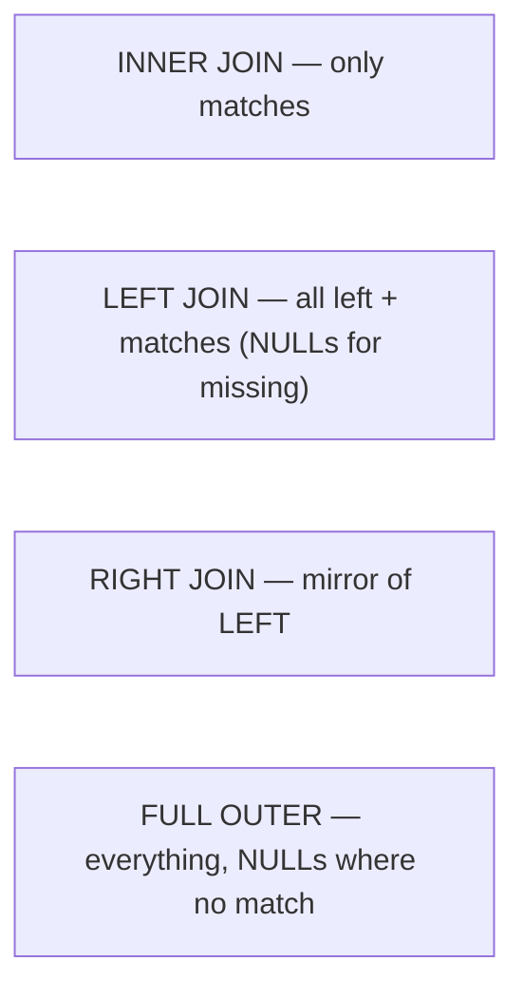

# Chapter 9 — Databases: Postgres, MongoDB, MySQL

> JD **must-have**: "MongoDB, Postgres" (MySQL preferred). Interviews test SQL fluency, indexing, transactions/ACID, and SQL-vs-NoSQL judgment.

## 9.1 SQL fluency — the queries you must write on a whiteboard

```sql
-- Schema for examples
CREATE TABLE machines (
    id         SERIAL PRIMARY KEY,
    name       TEXT NOT NULL,
    plant_id   INT REFERENCES plants(id),
    status     TEXT NOT NULL DEFAULT 'idle',
    created_at TIMESTAMPTZ NOT NULL DEFAULT now()
);
CREATE TABLE readings (
    id         BIGSERIAL PRIMARY KEY,
    machine_id INT NOT NULL REFERENCES machines(id),
    rpm        DOUBLE PRECISION NOT NULL,
    ts         TIMESTAMPTZ NOT NULL
);

-- Filtering, ordering, limiting
SELECT name, status FROM machines
WHERE status = 'running' AND created_at > now() - interval '7 days'
ORDER BY created_at DESC
LIMIT 20;

-- JOIN + aggregate + HAVING (the classic combo)
SELECT m.name, avg(r.rpm) AS avg_rpm, count(*) AS samples
FROM machines m
JOIN readings r ON r.machine_id = m.id
WHERE r.ts > now() - interval '1 hour'
GROUP BY m.name
HAVING avg(r.rpm) > 14000
ORDER BY avg_rpm DESC;

-- Subquery: machines with NO readings today (also try as LEFT JOIN ... IS NULL)
SELECT name FROM machines m
WHERE NOT EXISTS (
    SELECT 1 FROM readings r
    WHERE r.machine_id = m.id AND r.ts::date = current_date
);

-- Window function — senior bonus points: latest reading per machine
SELECT DISTINCT ON (machine_id) machine_id, rpm, ts
FROM readings ORDER BY machine_id, ts DESC;   -- Postgres idiom
```

### Joins visualized



**WHERE vs HAVING:** WHERE filters rows *before* grouping; HAVING filters groups *after* aggregation.

## 9.2 Indexes — the #1 performance topic

An index is a **B-tree** mapping column values → row locations: O(log n) lookups instead of full-table scans.

```sql
CREATE INDEX idx_readings_machine_ts ON readings (machine_id, ts);

-- ALWAYS verify with EXPLAIN:
EXPLAIN ANALYZE
SELECT * FROM readings WHERE machine_id = 42 AND ts > now() - interval '1 day';
-- Good: "Index Scan using idx_readings_machine_ts"
-- Bad:  "Seq Scan on readings"
```

Rules to recite:
- **Composite index column order matters**: `(machine_id, ts)` serves `WHERE machine_id=42` and `machine_id=42 AND ts>...`, but NOT `WHERE ts>...` alone (leftmost-prefix rule).
- Indexes speed reads but **slow writes** (each insert updates every index) and cost space — don't index everything.
- Functions on a column defeat the index (`WHERE lower(name)=...` needs an expression index).
- Primary keys and UNIQUE constraints create indexes automatically; **foreign keys do not** (in Postgres) — index FK columns you join on.

## 9.3 Transactions & ACID (guaranteed question)

| Property | Meaning |
|---|---|
| **Atomicity** | all statements commit or none do |
| **Consistency** | constraints hold before and after |
| **Isolation** | concurrent transactions don't see each other's partial work |
| **Durability** | committed data survives crashes (WAL) |

```sql
BEGIN;
UPDATE accounts SET balance = balance - 100 WHERE id = 1;
UPDATE accounts SET balance = balance + 100 WHERE id = 2;
COMMIT;   -- or ROLLBACK; — never a half-transfer
```

### Isolation levels & anomalies

| Level | Prevents | Notes |
|---|---|---|
| Read Uncommitted | — | dirty reads possible (Postgres doesn't really offer this) |
| **Read Committed** | dirty reads | **Postgres default** |
| Repeatable Read | + non-repeatable reads | MySQL/InnoDB default |
| Serializable | + phantoms; as if sequential | safest, retry on conflict |

**Practical answer:** "Default Read Committed is fine for most CRUD; I raise isolation (or use `SELECT ... FOR UPDATE` row locks) for read-modify-write invariants like balances or stock counts."

MVCC (Postgres/InnoDB): readers see a **snapshot**, writers create new row versions — readers never block writers. (Postgres needs VACUUM to reclaim dead versions.)

## 9.4 Normalization vs denormalization

- **1NF**: atomic values, no repeating groups. **2NF**: no partial dependency on a composite key. **3NF**: no transitive dependencies (non-key → non-key).
- Normalize for integrity (one fact, one place); **denormalize deliberately** for read-heavy paths (reporting tables, cached aggregates) and accept the update cost.

## 9.5 Postgres vs MySQL (one paragraph each is enough)

- **Postgres**: strictest SQL standard compliance, rich types (JSONB, arrays, ranges), powerful indexing (GIN/GiST/partial/expression), transactional DDL, extensions (PostGIS, TimescaleDB — relevant for machine telemetry!). Default choice for complex backends.
- **MySQL/InnoDB**: ubiquitous, excellent read-heavy performance and replication story, Repeatable Read default. Watch for: silent type coercions in older modes, DDL locking differences.

Postgres JSONB — the "NoSQL inside SQL" card:

```sql
ALTER TABLE machines ADD COLUMN config JSONB;
SELECT name FROM machines WHERE config->>'firmware' = '2.1';
CREATE INDEX idx_cfg ON machines USING GIN (config);   -- index inside the JSON
```

## 9.6 MongoDB — documents, when and how

Data lives as **BSON documents** in **collections**; schema is flexible per document.

```javascript
// CRUD
db.machines.insertOne({ name: "R37", status: "running",
                        sensors: [{ type: "temp", value: 21.5 }] });
db.machines.find({ status: "running" }, { name: 1, _id: 0 });
db.machines.updateOne({ name: "R37" }, { $set: { status: "idle" } });
db.machines.deleteOne({ name: "R37" });
db.machines.createIndex({ status: 1, name: 1 });   // same B-tree ideas apply!

// Aggregation pipeline (their "GROUP BY")
db.readings.aggregate([
    { $match: { ts: { $gte: ISODate("2026-07-01") } } },
    { $group: { _id: "$machineId", avgRpm: { $avg: "$rpm" } } },
    { $sort: { avgRpm: -1 } }
]);
```

**When Mongo fits:** flexible/evolving schemas, document-shaped data (the whole object read together), horizontal scaling via sharding, rapid prototyping.
**When SQL fits:** many-to-many relations, multi-row transactional invariants, ad-hoc joins/reporting. (Mongo has multi-document transactions since 4.0, but they cost more — model documents to avoid needing them.)

**Document modeling rule:** *embed* what you read together (sensor list inside machine), *reference* what's shared or unbounded (readings stream → own collection).

## 9.7 Using databases from Rust/C++ (practical credibility)

```rust
// sqlx — async, compile-time checked SQL (name-drop this!)
let pool = sqlx::postgres::PgPoolOptions::new()
    .max_connections(10)                      // connection POOLING — always mention
    .connect(&std::env::var("DATABASE_URL")?).await?;

let rows = sqlx::query!("SELECT id, name FROM machines WHERE status = $1", status)
    .fetch_all(&pool).await?;                 // $1 = parameterized → no SQL injection
```

Talking points:
- **Connection pooling**: connections are expensive; a pool reuses them (sqlx pool, pgbouncer). Every serious backend has one.
- **Parameterized queries always** — string concatenation = SQL injection (see Q&A).
- **N+1 problem**: fetching a list then querying per item → 1+N round trips; fix with a JOIN or `WHERE id = ANY($1)`.
- **Migrations**: schema changes as versioned SQL files in the repo (sqlx migrate, Flyway, Liquibase).
- Crates: `sqlx`/`diesel`/`sea-orm` (SQL), official `mongodb` driver. C++: `libpqxx`, `mongocxx`.

---

## 🎯 Chapter 9 Interview Q&A

**Q1. What is SQL injection and the fix?**
Untrusted input concatenated into SQL becomes executable (`' OR 1=1 --`). Fix: parameterized/prepared statements everywhere; never build SQL strings from input.

**Q2. Your query is slow — walk me through diagnosis.**
`EXPLAIN ANALYZE` → look for Seq Scans on big tables, bad row estimates, nested-loop blowups → add/fix indexes (check leftmost-prefix), rewrite the query, check table bloat/statistics (`ANALYZE`), consider denormalizing or caching.

**Q3. Why not index every column?**
Every index slows every write and consumes space and cache; the planner may not even use them. Index what your WHERE/JOIN/ORDER BY patterns need — measured, not guessed.

**Q4. DELETE vs TRUNCATE vs DROP?**
DELETE removes rows (can filter, fires triggers, MVCC-versioned); TRUNCATE empties the table fast (no per-row work); DROP removes the table itself.

**Q5. Optimistic vs pessimistic locking?**
Pessimistic: lock rows up front (`SELECT ... FOR UPDATE`) — simple, can contend. Optimistic: read a version column, update `WHERE version = old`, retry if 0 rows — great when conflicts are rare.

**Q6. What is a deadlock in the database and how do DBs handle it?**
Two transactions each hold locks the other needs. The DB detects the cycle, kills one (deadlock error) — the app must retry. Prevent by locking rows in consistent order and keeping transactions short.

**Q7. UNIQUE constraint vs application-level check?**
Check-then-insert in code has a race window; only the DB constraint is safe under concurrency. Use `INSERT ... ON CONFLICT DO NOTHING/UPDATE` (upsert).

**Q8. How would you store machine telemetry (high write volume)?**
Append-only table partitioned by time (or TimescaleDB), composite index `(machine_id, ts)`, batch inserts, retention by dropping old partitions (instant vs slow DELETEs), pre-aggregated rollups for dashboards.

**Q9. SQL vs NoSQL — how do you choose?**
Relations, cross-entity transactions, ad-hoc queries → SQL. Document-shaped reads, evolving schema, horizontal write scaling → Mongo. Often both: Postgres as source of truth, Mongo/cache for specific read models. Never "NoSQL because it's webscale".

**Q10. What is a covering index?**
An index containing every column the query needs (`INCLUDE (...)`), so the DB answers from the index alone — an index-only scan, no heap visits.

**Q11. What happens on COMMIT that makes it durable?**
The write-ahead log (WAL) record is flushed to disk before success is returned; data pages update later. Crash recovery replays the WAL.

**Q12. Explain replication lag and one bug it causes.**
Read replicas apply the primary's WAL asynchronously, so they trail slightly. Classic bug: write to primary, immediately read from replica → your own write is missing (read-your-writes violation). Fix: read from primary after writes or use sync replication for that path.
