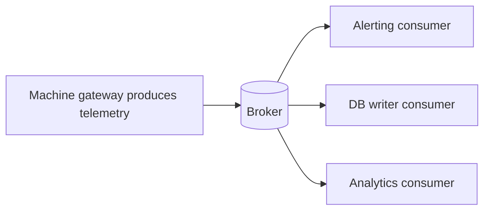
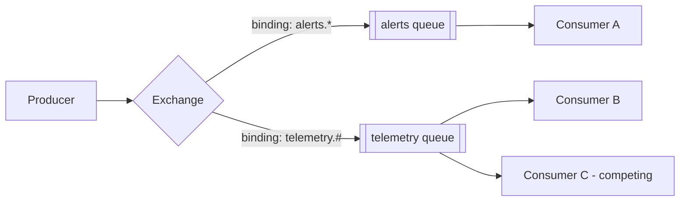
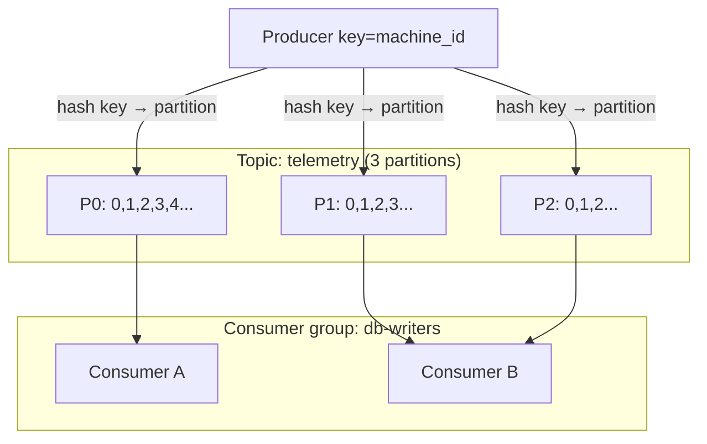

# Chapter 10 — Messaging: Kafka & RabbitMQ

> JD keywords: RabbitMQ, Kafka. Interviews test: why async messaging, how each broker works, delivery guarantees, and "which would you pick?"

## 10.1 Why message queues at all?

Synchronous service-to-service calls couple availability and speed. A broker in between gives you:

- **Decoupling** — producer doesn't know/care who consumes.
- **Buffering** — absorb spikes; consumers work at their own pace.
- **Resilience** — consumer down? Messages wait.
- **Fan-out** — one event, many independent consumers.



## 10.2 RabbitMQ — smart broker, simple consumer

AMQP model: producers publish to an **exchange**; the exchange routes to **queues** via **bindings**; consumers take messages from queues.



**Exchange types (know all four):**
| Type | Routing |
|---|---|
| direct | exact routing-key match |
| topic | pattern match (`machine.*.alert`, `#` = many words) |
| fanout | copy to every bound queue |
| headers | match on header values (rare) |

**Consumer mechanics:**
- **ack**: consumer confirms after processing; unacked messages are redelivered if the consumer dies. `nack`/`reject` can requeue or discard.
- **prefetch (QoS)**: limit unacked messages per consumer — prevents one consumer hogging the queue.
- **Dead-letter exchange (DLX)**: failed/expired messages route to a dead-letter queue for inspection — always mention this for error handling.
- Durability = durable queue + persistent messages + publisher confirms.

```rust
// Rust: lapin crate (AMQP) — shape of a consumer
let channel = conn.create_channel().await?;
channel.basic_qos(10, BasicQosOptions::default()).await?;   // prefetch
let mut consumer = channel.basic_consume("telemetry", "worker-1",
    BasicConsumeOptions::default(), FieldTable::default()).await?;
while let Some(delivery) = consumer.next().await {
    let delivery = delivery?;
    process(&delivery.data)?;
    delivery.ack(BasicAckOptions::default()).await?;         // ack AFTER processing
}
```

## 10.3 Kafka — distributed, replayable log

Kafka is not a queue — it's an **append-only log**. Messages go to **topics**, split into **partitions**; each message gets a sequential **offset**. Messages are **not deleted on consumption** — they expire by retention policy (time/size), so you can **replay**.



**Core rules to recite:**
- **Ordering is guaranteed only within a partition.** Same key (e.g., machine_id) → same partition → per-machine ordering.
- **Consumer group**: partitions are divided among the group's members — scale consumers up to the partition count. Each group tracks its own offsets independently (fan-out = multiple groups).
- Consumers **commit offsets** to record progress; crash → resume from last commit (→ possible reprocessing = at-least-once).
- Replication: each partition has a leader + followers (ISR); producer `acks=all` waits for replicas.
- Retention/compaction: keep 7 days, or compact to latest value per key.

## 10.4 Delivery semantics (asked in EVERY messaging interview)

| Guarantee | Meaning | Cost |
|---|---|---|
| **At-most-once** | may lose, never duplicate (ack before processing) | cheapest |
| **At-least-once** | never lose, may duplicate (ack after processing) | **the practical default** |
| **Exactly-once** | neither | hard; Kafka transactions or idempotent consumers |

**The senior answer:** "I design for at-least-once and make consumers **idempotent** — dedupe by message ID, or use upserts/natural idempotency — rather than chasing exactly-once through the whole pipeline."

Also know: **outbox pattern** — write DB change + outgoing event in one DB transaction; a relay publishes from the outbox table. Solves "DB committed but publish failed".

## 10.5 Kafka vs RabbitMQ — the decision table

| | RabbitMQ | Kafka |
|---|---|---|
| Model | smart routing, message deleted on ack | dumb broker, replayable log |
| Strength | task queues, complex routing, per-message ack, low latency | huge throughput, event streaming, replay, ordering by key |
| Consumers | compete on a queue | partition assignment in groups |
| Replay old messages | ❌ (gone after ack) | ✅ (rewind offsets) |
| Typical use | background jobs, RPC, work distribution | telemetry pipelines, event sourcing, log aggregation, analytics feeds |

**Interview line for this JD:** "For machine telemetry streams I'd choose Kafka — keyed partitions give per-machine ordering, retention allows replay for new consumers or reprocessing. For work distribution like 'generate this report' or command routing, RabbitMQ's acks, routing, and DLQs fit better."

## 10.6 Operational things worth name-dropping

- **Consumer lag** (Kafka): how far behind the group is — the #1 health metric; monitor with `kafka-consumer-groups --describe`.
- **Rebalancing**: consumers joining/leaving a group pause consumption while partitions reassign — keep processing fast, heartbeat healthy.
- **Poison messages**: a message that always crashes the consumer — catch, retry N times, then dead-letter; never infinite-requeue.
- **Backpressure**: bounded prefetch/poll sizes so consumers aren't overwhelmed.
- Rust clients: `rdkafka` (Kafka, wraps librdkafka — a C library, nice FFI tie-in to Ch 7), `lapin` (RabbitMQ).

---

## 🎯 Chapter 10 Interview Q&A

**Q1. Queue vs pub/sub?**
Queue: competing consumers, each message processed once (work distribution). Pub/sub: every subscriber gets every message (fan-out). RabbitMQ does both via exchanges; Kafka via one vs many consumer groups.

**Q2. How does Kafka scale consumption?**
Add partitions and consumers in a group — each partition is consumed by exactly one member of the group. Beyond partition count, extra consumers idle.

**Q3. How do you preserve event order for one machine in Kafka?**
Produce with the machine ID as the message key — hashing sends all its events to one partition, which preserves order.

**Q4. Consumer crashes mid-processing — what happens?**
RabbitMQ: unacked message is redelivered to another consumer. Kafka: offset wasn't committed, so the rebalanced consumer re-reads it. Both mean at-least-once → consumers must be idempotent.

**Q5. What is a dead-letter queue and why do you need one?**
A parking queue for messages that failed repeatedly or expired. Without it, poison messages either block the queue or requeue forever. DLQ + alerting + manual/automated replay is the standard pattern.

**Q6. Exactly-once — possible?**
End-to-end, only with cooperation: Kafka idempotent producers + transactions cover Kafka-to-Kafka; once side effects (DB writes, emails) are involved, you achieve it with idempotent consumers / dedupe keys, i.e., "effectively once".

**Q7. How do you keep 'save to DB' and 'publish event' consistent?**
Outbox pattern: insert the event into an outbox table in the same DB transaction as the change; a relay (or CDC/Debezium) publishes it. Avoids dual-write inconsistency.

**Q8. What is consumer lag and what causes it to grow?**
Difference between the latest offset and the group's committed offset. Grows when consumers are too slow, crashed, rebalancing constantly, or a poison message stalls a partition.

**Q9. When is a message broker the WRONG choice?**
When the caller needs an immediate answer (request/response — use HTTP/gRPC), for tiny systems where a broker adds ops burden, or when strict global ordering across all events is required.

**Q10. RabbitMQ prefetch = 1 vs 100 — tradeoff?**
1: perfectly fair distribution, slow (round-trip per message). 100: high throughput but one consumer can buffer messages others could process, and redelivery batches grow on crash. Tune by processing time.
