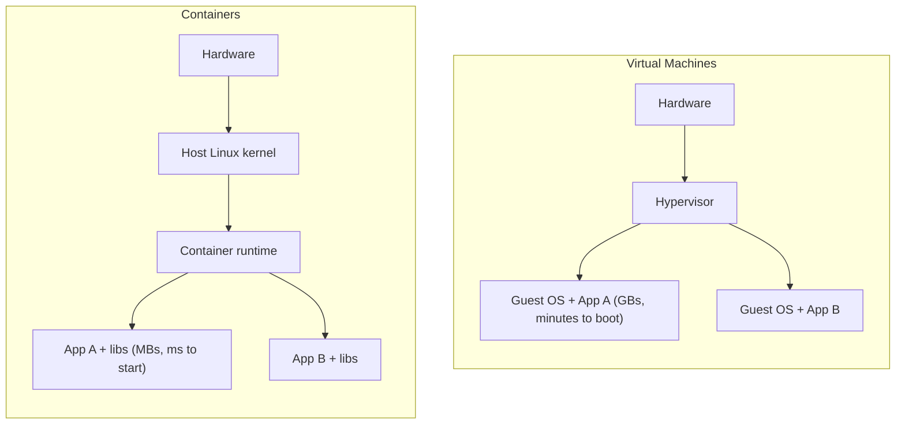
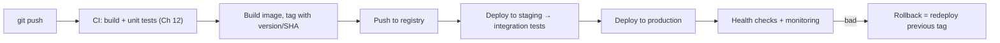

# Chapter 11 — Docker & Deployment

> JD keywords: Docker, "Build and deploy the code to the environment", VMs. Expect: containers vs VMs, writing a Dockerfile, compose, and deployment/debugging basics.

## 11.1 Containers vs VMs (the opener question)



- Containers **share the host kernel**; isolation comes from **namespaces** (what a process can see: PIDs, network, mounts) and **cgroups** (what it can use: CPU, memory) — tie this to Ch 5 for bonus points.
- VMs virtualize hardware and run full guest OSes — stronger isolation, heavier.
- They compose: production containers usually run **on** VMs. (JD mentions VMs/VDIs — your dev environment may be a VDI.)

**Interview line:** "A container is just a normal Linux process wearing namespaces and cgroups — not a lightweight VM."

## 11.2 Images, layers & the Dockerfile

An **image** is a stack of read-only layers (one per Dockerfile instruction); a **container** is a running instance with a thin writable layer on top. Layers are cached and shared between images.

### Multi-stage Dockerfile for Rust (memorize this pattern!)

```dockerfile
# ---- Stage 1: build (has compiler, ~2GB) ----
FROM rust:1.85 AS builder
WORKDIR /app
# Cache dependencies: copy manifests first, build a dummy, then real source
COPY Cargo.toml Cargo.lock ./
RUN mkdir src && echo "fn main(){}" > src/main.rs && cargo build --release
COPY src ./src
RUN touch src/main.rs && cargo build --release

# ---- Stage 2: runtime (tiny, no toolchain) ----
FROM debian:bookworm-slim
RUN useradd -m appuser
COPY --from=builder /app/target/release/server /usr/local/bin/server
USER appuser                      # never run as root
EXPOSE 8080
HEALTHCHECK CMD curl -f http://localhost:8080/health || exit 1
CMD ["server"]
```

Why multi-stage (say all three): final image is **small** (no compiler), **safer** (less attack surface), **faster to pull/deploy**. Same pattern applies to C++ (gcc stage → slim runtime).

Layer-caching rule: **order instructions least→most frequently changing** (deps before source) so code edits don't rebuild dependency layers.

## 11.3 The daily command set

```bash
docker build -t myapp:1.2.0 .
docker run -d --name myapp -p 8080:8080 \
    -e DATABASE_URL=postgres://db:5432/app \
    --memory=512m --cpus=1 \
    myapp:1.2.0

docker ps                      # running containers
docker logs -f myapp           # follow logs (stdout/stderr — log there, not files!)
docker exec -it myapp bash     # shell inside — debugging must-know
docker inspect myapp           # full config, IP, mounts
docker stats                   # live CPU/mem per container
docker stop myapp              # sends SIGTERM, then SIGKILL after grace — Ch 5!
docker system prune            # clean unused images/containers

docker push registry.example.com/myapp:1.2.0    # publish to a registry
```

**Volumes & networking essentials:**
```bash
docker volume create pgdata
docker run -v pgdata:/var/lib/postgresql/data postgres:16   # data survives container
docker network create backend
# containers on the same network reach each other BY NAME (built-in DNS)
```

## 11.4 docker compose — the whole stack in one file

```yaml
# compose.yaml — app + Postgres + RabbitMQ (ties Ch 9 & 10 together)
services:
  app:
    build: .
    ports: ["8080:8080"]
    environment:
      DATABASE_URL: postgres://app:secret@db:5432/app
      AMQP_URL: amqp://mq:5672
    depends_on:
      db: { condition: service_healthy }
  db:
    image: postgres:16
    environment:
      POSTGRES_USER: app
      POSTGRES_PASSWORD: secret
    volumes: ["pgdata:/var/lib/postgresql/data"]
    healthcheck:
      test: ["CMD-SHELL", "pg_isready -U app"]
      interval: 5s
  mq:
    image: rabbitmq:3-management
    ports: ["15672:15672"]        # management UI
volumes:
  pgdata:
```

```bash
docker compose up -d      # start everything
docker compose logs -f app
docker compose down       # stop (add -v to wipe volumes)
```

**Interview line:** "Compose gives every developer an identical local stack — DB, broker, app — in one command; it kills 'works on my machine'."

## 11.5 Deployment practices (the JD's "build and deploy" bullet)



Talking points:
- **Tag images immutably** (version or git SHA, never rely on `latest`) → rollback is just deploying the old tag.
- **12-factor basics**: config via env vars, logs to stdout, stateless app containers (state lives in DB/volumes).
- **Health endpoints**: liveness ("process alive?") vs readiness ("can serve traffic? DB reachable?").
- **Graceful shutdown**: handle SIGTERM, drain requests (Ch 5/7) — orchestrators depend on it.
- Deployment strategies to name: **rolling** (replace instances gradually), **blue-green** (two environments, switch), **canary** (small % first).
- **Kubernetes** in one sentence: "an orchestrator that keeps a declared number of container replicas healthy across a cluster, with service discovery, rolling updates, and self-healing — compose for datacenters." (Good-to-have for this JD; one sentence is enough.)

## 11.6 Debugging a container that won't work (practical scenario)

1. `docker ps -a` — did it exit? What code? (137 = OOM-killed/SIGKILL, 139 = segfault)
2. `docker logs myapp` — stack trace? panic? missing env?
3. `docker exec -it myapp sh` — look around: config present? can you reach the DB (`nc -z db 5432`)?
4. `docker inspect` — env vars, network, mounts as expected?
5. `docker stats` / `dmesg` — hitting memory limits?

---

## 🎯 Chapter 11 Interview Q&A

**Q1. Container vs image?**
Image: immutable layered template. Container: a running (or stopped) instance of it with a writable layer. One image → many containers.

**Q2. What actually isolates a container?**
Linux namespaces (PID, net, mount, user...) limit visibility; cgroups limit CPU/memory; capabilities/seccomp restrict syscalls. Same kernel as the host.

**Q3. Why multi-stage builds?**
Compile in a heavy toolchain stage, copy only the binary into a slim runtime stage → small, fast-to-pull, low-attack-surface images.

**Q4. Container exits with code 137 — meaning?**
128+9 = killed by SIGKILL, almost always the OOM killer via the cgroup memory limit. Check `docker inspect` (OOMKilled: true), raise the limit or fix the leak (Ch 3).

**Q5. How do containers talk to each other locally?**
Put them on the same user-defined network; Docker's embedded DNS resolves service/container names (`db:5432`). Compose does this automatically.

**Q6. Where should container state live?**
Not in the container's writable layer (dies with it). Volumes/bind mounts for data (Postgres data dir), or better — externalize state to managed DBs; keep app containers stateless.

**Q7. What happens on `docker stop`?**
SIGTERM to PID 1, grace period (default 10s), then SIGKILL. Your app must trap SIGTERM to shut down cleanly — and note PID 1 doesn't get default signal handlers, hence `init: true` or proper handling.

**Q8. How do you keep images small?**
Slim/distroless base, multi-stage, .dockerignore (exclude target/, .git), combine RUN steps to avoid junk layers, don't install build tools in runtime image.

**Q9. `CMD` vs `ENTRYPOINT`?**
ENTRYPOINT = fixed executable; CMD = default arguments (overridable at `docker run`). Common combo: `ENTRYPOINT ["server"]` + `CMD ["--config", "/etc/app.toml"]`.

**Q10. How would you roll back a bad deployment?**
Images are immutable and tagged — redeploy the previous tag; DB migrations must be backward-compatible (expand-migrate-contract) so old code still runs.
