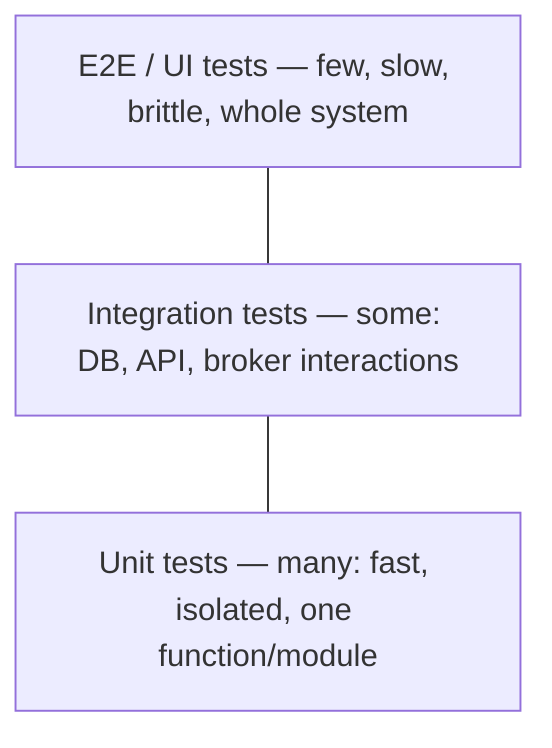

# Chapter 12 — Testing & QA

> JD **must-have**: "Unit test development and testing concepts", plus "Testing and QA methodologies", test reports, integrating testing tools. This chapter makes you sound like someone who ships tested code by default.

## 12.1 The test pyramid (draw it, explain the ratios)



**Interview line:** "Many fast unit tests, fewer integration tests, few end-to-end tests. The higher the level, the more confidence per test but the slower and flakier — so push logic testing down the pyramid."

## 12.2 Unit testing in Rust (built into the language!)

```rust
// src/lib.rs — tests live NEXT to the code in a test module
pub fn parse_rpm(s: &str) -> Result<f64, String> {
    let v: f64 = s.trim().parse().map_err(|_| format!("not a number: {s}"))?;
    if !(0.0..=30_000.0).contains(&v) { return Err(format!("out of range: {v}")); }
    Ok(v)
}

#[cfg(test)]
mod tests {
    use super::*;

    #[test]
    fn parses_valid_rpm() {
        assert_eq!(parse_rpm(" 15000 ").unwrap(), 15000.0);
    }

    #[test]
    fn rejects_out_of_range() {
        assert!(parse_rpm("99999").is_err());
    }

    #[test]
    #[should_panic(expected = "boom")]
    fn panics_are_testable() { panic!("boom"); }
}
```

```bash
cargo test                    # run all
cargo test parses_valid      # filter by name
cargo test -- --nocapture    # show println! output
```

- **Unit tests**: `#[cfg(test)] mod tests` in the same file — can test private functions.
- **Integration tests**: `tests/` directory — separate crate, tests the public API only.
- **Doc tests**: code examples in `///` comments are compiled and run — docs never rot. Unique Rust selling point, mention it!

### Mocking in Rust — traits are the seam

```rust
pub trait Repo {
    fn save(&self, rpm: f64) -> Result<(), String>;
}

pub fn record(repo: &impl Repo, input: &str) -> Result<(), String> {
    repo.save(parse_rpm(input)?)                 // depends on the TRAIT
}

#[cfg(test)]
struct FakeRepo { fail: bool }
#[cfg(test)]
impl Repo for FakeRepo {
    fn save(&self, _: f64) -> Result<(), String> {
        if self.fail { Err("db down".into()) } else { Ok(()) }
    }
}

#[test]
fn propagates_repo_errors() {
    assert!(record(&FakeRepo { fail: true }, "100").is_err());
}
```

Name-drop crates: **mockall** (auto-generated mocks), **proptest**/**quickcheck** (property-based testing: "parse(format(x)) == x for random x"), **criterion** (benchmarks).

## 12.3 Unit testing in C++ — GoogleTest

```cpp
#include <gtest/gtest.h>

TEST(ParseRpm, ValidInput) {
    EXPECT_DOUBLE_EQ(parse_rpm("15000"), 15000.0);
}

TEST(ParseRpm, OutOfRangeThrows) {
    EXPECT_THROW(parse_rpm("99999"), std::out_of_range);
}

// Fixture — shared setup/teardown
class MachineTest : public ::testing::Test {
protected:
    void SetUp() override { m.configure(defaults); }
    Machine m;
};
TEST_F(MachineTest, StartsIdle) { EXPECT_EQ(m.status(), Status::Idle); }
```

- `EXPECT_*` continues after failure, `ASSERT_*` aborts the test — use ASSERT for preconditions.
- **GoogleMock** for mock objects; **Catch2**/doctest as alternatives.
- Run C++ tests under **sanitizers** in CI (Ch 3) — tests + ASan catch memory bugs unit assertions can't.

## 12.4 What makes a GOOD unit test

**FIRST**: Fast, Independent (any order), Repeatable (no flakiness), Self-validating (pass/fail, no manual inspection), Timely (written with the code).

Structure every test as **AAA**:
```rust
#[test]
fn applies_discount() {
    let cart = Cart::with_items(3);          // Arrange
    let total = cart.total_with_discount();  // Act
    assert_eq!(total, 270);                  // Assert — ideally ONE concept per test
}
```

What to test (say this list): happy path, **boundaries** (0, max, empty, one), error paths, invalid input. What NOT to test: private implementation details, third-party libraries, getters.

**TDD in one breath:** "Red — write a failing test; Green — minimal code to pass; Refactor — clean up with tests as a safety net. I use it selectively — great for pure logic and bug fixes (regression test first), less for exploratory work."

## 12.5 Integration testing a backend (ties Ch 9–11 together)

```rust
// tests/api_test.rs — spin up real Postgres via testcontainers
#[tokio::test]
async fn creates_and_fetches_machine() {
    let db = testcontainers::run_postgres().await;     // real DB in Docker
    let app = spawn_app(&db.url()).await;              // your API on a random port

    let res = reqwest::Client::new()
        .post(format!("{}/api/v1/machines", app.addr))
        .json(&serde_json::json!({"name": "R37"}))
        .send().await.unwrap();

    assert_eq!(res.status(), 201);
}
```

Principles: test against **real dependencies in containers** (testcontainers) rather than mocking the DB — SQL and mappings are where bugs live; each test gets isolated state (fresh schema/transaction rollback).

## 12.6 QA methodologies vocabulary (JD asks for it — know the terms)

| Term | Meaning |
|---|---|
| **Functional testing** | does the feature meet requirements |
| **Regression testing** | old features still work after changes — automated suites ARE this |
| **Smoke testing** | quick "is it fundamentally alive" after deploy |
| **Black box / white box** | testing without / with knowledge of internals |
| **Boundary value analysis** | test at edges: 0, 1, max, max+1 |
| **Equivalence partitioning** | one test per class of inputs behaving the same |
| **Non-functional** | performance, load, stress, security testing |
| **UAT** | user/customer acceptance before release |
| **Verification vs Validation** | built it right vs built the right thing |

**Severity vs priority** (bug triage): severity = technical impact (crash vs cosmetic); priority = business urgency to fix. A typo on the homepage: low severity, high priority.

**A good bug report contains:** steps to reproduce, expected vs actual, environment/version, logs/screenshots, severity. (You'll file these in Jira — Ch 13.)

## 12.7 Test reports & CI integration (JD: "create test reports", "integrate testing tools")

```yaml
# .gitlab-ci.yml — tests as a pipeline gate
test:
  image: rust:1.85
  script:
    - cargo fmt --check          # style gate
    - cargo clippy -- -D warnings # lint gate
    - cargo test --workspace
    - cargo llvm-cov --lcov --output-path coverage.lcov   # coverage
  artifacts:
    reports:
      junit: target/junit.xml    # test report visible in MRs
```

Talking points:
- **JUnit XML** is the lingua franca of test reports — CI systems (GitLab, Azure DevOps, Jenkins) render pass/fail trends from it (`cargo nextest` emits it; GoogleTest: `--gtest_output=xml`).
- **Coverage** (llvm-cov, gcov): useful signal, terrible target — "100% coverage proves lines ran, not that behavior is asserted." Say ~70–85% pragmatic on core logic.
- Failing tests **block the merge** — that's the whole point.

---

## 🎯 Chapter 12 Interview Q&A

**Q1. Unit vs integration test?**
Unit: one module in isolation, dependencies replaced via seams (traits/interfaces), milliseconds. Integration: real collaborators (DB, HTTP, broker), verifies the wiring, slower.

**Q2. How do you test code that talks to a database?**
Split logic from I/O and unit test logic; for the I/O layer, integration tests against a real containerized DB (testcontainers) with per-test isolation — not DB mocks, which just mirror the implementation.

**Q3. Mock vs stub vs fake?**
Stub: returns canned answers. Mock: additionally verifies interactions (was save() called with X?). Fake: a working lightweight implementation (in-memory repo). Prefer fakes/stubs; over-mocking couples tests to internals.

**Q4. What's a flaky test and how do you fix it?**
Passes/fails nondeterministically — causes: timing/sleeps, shared state, test order, real network, concurrency. Fix root cause: await conditions instead of sleeping, isolate state, control the clock (inject a time source). Never just retry-loop it.

**Q5. How much coverage is enough?**
Coverage measures execution, not correctness. High coverage on domain logic (80%+), less on glue. A meaningful metric review: are boundaries and error paths asserted?

**Q6. How do you write a regression test?**
Reproduce the bug in a failing test FIRST, then fix until green. The test permanently guards that behavior — the most valuable tests in any suite.

**Q7. How do you test error handling in Rust?**
Errors are values: `assert!(matches!(f(), Err(AppError::Config(_))))`. Test each failure branch; `#[should_panic]` only for true invariant violations.

**Q8. How do you test concurrent code?**
Minimize what's concurrent, test logic single-threaded; stress-test with many threads + ThreadSanitizer (C++) / loom (Rust, model-checks interleavings); make operations deterministic via channels rather than shared state.

**Q9. What is property-based testing?**
Instead of examples, assert invariants over generated random inputs ("serialize→deserialize is identity"); the framework shrinks failures to minimal cases. proptest (Rust), rapidcheck (C++).

**Q10. Tests slow the team down — respond?**
Untested code slows teams more: fear of change, manual re-verification, production bugs. Fast unit suites run in seconds, gate CI, and enable refactoring — tests are what make speed sustainable.
