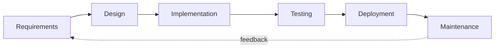
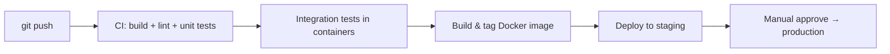

# Chapter 13 — SDLC, Git, Jira & Requirements

> JD asks for: "experience with the full software development lifecycle", "Git", "Jira / issue tracking", and "translating requirements into technical solutions". This chapter is short on code and long on *sounding like a professional who has shipped software in a team*.

## 13.1 SDLC — the phases and where YOU fit



| Phase | What happens | Your artifacts |
|---|---|---|
| Requirements | What must the system do? Functional + non-functional | user stories, acceptance criteria |
| Design | How will it do it? | architecture diagram, API contract, DB schema |
| Implementation | Write it | code + unit tests + code review |
| Testing | Verify it | integration/E2E tests, bug reports (Ch 12) |
| Deployment | Ship it | Docker image, CI/CD pipeline (Ch 11) |
| Maintenance | Keep it alive | monitoring, hotfixes, refactoring |

**Waterfall vs Agile in one line:** waterfall does the phases once, in order, for the whole project; agile does *all* the phases in every 2-week sprint, so feedback arrives early and cheap.

## 13.2 Agile / Scrum vocabulary (they WILL probe this)

- **Sprint** — fixed timebox (usually 2 weeks) producing a potentially shippable increment.
- **Product backlog** — prioritized list of everything wanted; the **sprint backlog** is what the team committed to this sprint.
- **Ceremonies**: sprint planning (what & how), daily standup (yesterday / today / blockers — 15 min max), sprint review/demo (show stakeholders), retrospective (improve the *process*).
- **Roles**: Product Owner owns *what* and priorities; Scrum Master removes impediments and guards the process; the dev team owns *how*.
- **Story points** — relative effort estimates (Fibonacci: 1,2,3,5,8…). Velocity = points completed per sprint, used for forecasting — never for comparing developers.
- **Definition of Done** — team-agreed checklist (code reviewed, tests pass, docs updated, deployed to staging). Prevents "done… except".

**Interview line:** "I've worked in Scrum: 2-week sprints, planning, daily standups, demo and retro. What I value most is the retro — that's where the process actually improves."

## 13.3 Requirements engineering (JD: "analyze requirements and specifications")

A good **user story**:

```text
As a machine operator,
I want to see live spindle RPM on the dashboard,
so that I can react before quality drops.

Acceptance criteria (testable!):
- RPM updates at least every 2 s
- Values out of range 0–30 000 are flagged red
- Works for up to 50 machines on one screen
```

- **Functional requirements** = what the system does (store readings, expose REST API).
- **Non-functional requirements (NFRs)** = how well: latency, throughput, availability, security, maintainability. *Backend interviews love NFRs* — always ask about them in system-design questions (Ch 16).
- When requirements are vague, say your process: **ask clarifying questions → restate in your own words → write acceptance criteria → get sign-off before coding.** Cheapest bugs are the ones fixed in the requirements phase.

## 13.4 Git — the commands you must know cold

```bash
# Daily flow
git switch -c feature/rpm-endpoint     # new branch
git add -p                             # stage interactively (review your own diff!)
git commit -m "Add /machines/{id}/rpm endpoint"
git push -u origin feature/rpm-endpoint

# Staying current
git fetch origin
git rebase origin/main                 # replay my commits on latest main
# ...or...
git merge origin/main                  # merge main into my branch

# Inspecting
git log --oneline --graph --all
git diff main...HEAD                   # what my branch adds
git blame src/api.rs                   # who last touched each line
git bisect start                       # binary-search for the commit that broke it

# Undoing (know ALL THREE)
git restore file.rs                    # discard working-tree change
git reset --soft HEAD~1                # undo commit, keep changes staged
git revert abc123                      # NEW commit that undoes abc123 — safe on shared branches
```

### Merge vs rebase — the classic question

- **Merge**: preserves true history, creates a merge commit. Safe, but history gets noisy.
- **Rebase**: rewrites your commits on top of the target — linear, clean history. **Never rebase commits that others have already pulled** (rewriting shared history forces everyone to recover).
- Common team policy: *rebase your feature branch locally, then merge (or squash-merge) into main via a pull request.*

### Resolving a conflict — narrate it like this

"Git marks the conflicting region with `<<<<<<<`, `=======`, `>>>>>>>`. I open the file, understand *both* changes — not just pick a side — edit to the correct combined result, `git add` the file, and continue the rebase/merge. Then I re-run the tests before pushing."

### Branching strategies

| Strategy | Idea | When |
|---|---|---|
| **GitHub Flow** | main is always deployable; short-lived feature branches + PRs | most teams, CD environments |
| **Git Flow** | develop + main + release/hotfix branches | versioned/boxed releases, firmware |
| **Trunk-based** | everyone commits to main behind feature flags | high-maturity CI teams |

## 13.5 Code review — both directions

As the **author**: small PRs (< ~400 lines review meaningfully), self-review the diff first, write a description that says *why*, don't take comments personally.
As the **reviewer**: correctness first, then readability, then style (a linter should own style); ask questions instead of commanding ("what happens if this is empty?"); approve when it's *better than before*, not perfect.

## 13.6 Jira in practice

- Hierarchy: **Epic** (big feature) → **Story** (user-visible slice) → **Task/Sub-task** (dev work) → **Bug**.
- A ticket flows across a board: `To Do → In Progress → In Review → Done` (workflows are customizable).
- Good habits to mention: keep tickets updated so standup is redundant, link commits/PRs to the ticket key (`RIETER-123: fix RPM overflow`), log blockers immediately, attach reproduction steps to bugs (Ch 12.6).
- Jira is also where **traceability** lives: requirement → story → commits → test report. Regulated/industrial environments (like textile machinery!) care about this chain.

## 13.7 CI/CD in one diagram (connects Ch 11 & 12)



**CI** = every push is built and tested automatically → integration problems surface in minutes. **CD** = the artifact that passed is deployable (delivery) or deployed (deployment) automatically. The pipeline is the *only* path to production — no snowflake manual deploys.

---

## 🎯 Chapter 13 Interview Q&A

**Q1. Walk me through your development workflow on a new task.**
Read the ticket, clarify acceptance criteria with the PO if ambiguous, break it into sub-tasks, branch from main, TDD the core logic, open a small PR with a why-description, address review, squash-merge; CI deploys to staging where I verify against the acceptance criteria, then move the ticket to Done.

**Q2. Merge vs rebase?**
Both integrate changes. Merge keeps real history plus a merge commit; rebase replays my commits for linear history. I rebase my *local* feature branch to stay current, but never rewrite pushed/shared history; the team merges PRs into main.

**Q3. You committed to the wrong branch — what do you do?**
If not pushed: `git switch correct-branch && git cherry-pick <sha>`, then `git reset --hard HEAD~1` on the wrong branch. If pushed to a shared branch: `git revert` — never rewrite shared history.

**Q4. How do you find which commit introduced a bug?**
`git bisect`: mark a known-good and known-bad commit, git binary-searches; with a test script (`git bisect run ./test.sh`) it's fully automatic — log₂(n) builds to find the culprit.

**Q5. What makes a good commit?**
Atomic (one logical change), builds and passes tests on its own, imperative subject line ≤ 50 chars, body explains *why*. Ticket reference for traceability.

**Q6. Requirements are unclear and the PO is on holiday. What do you do?**
Don't guess silently: document my assumptions in the ticket, choose the interpretation that's cheapest to change later, build behind a small seam so it's swappable, and flag it in standup so the decision is visible.

**Q7. Story points vs hours?**
Points measure relative complexity/uncertainty, not time — they normalize across developers and get more accurate as the team calibrates. Velocity then converts points to forecast, per team, per sprint.

**Q8. What happens in a retrospective?**
The team inspects the *process*: what went well, what didn't, and 1–2 concrete experiments for next sprint (e.g. "PRs reviewed within 4 h"). Blameless — problems are systemic, not personal.

**Q9. How do you handle a production hotfix under Git Flow?**
Branch `hotfix/x` from main, fix + regression test, merge back to *both* main (tag release) and develop so the fix isn't lost at the next release.

**Q10. Why small pull requests?**
Review quality collapses with size — a 2000-line PR gets a "LGTM", a 200-line PR gets real scrutiny. Small PRs also merge faster, conflict less, and are trivially revertable.
