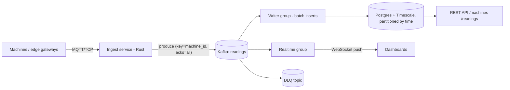

# Chapter 16 — Coding Exercises & System Design

> Practice *doing*, not just knowing. Each exercise: attempt it cold (timer on), then compare with the solution notes. Exercises are chosen to hit JD skills: C++/Rust idioms, memory, concurrency, backend design.

## How to work an exercise in an interview

1. **Restate** the problem + ask about inputs, sizes, edge cases (empty? duplicates? overflow?).
2. **Talk through the approach** and its complexity *before* coding.
3. Write clean code, narrating; handle errors explicitly (Rust: return `Result`, don't `unwrap` blindly).
4. **Test out loud**: happy path, boundaries, error path.
5. Discuss improvements: complexity, allocations, concurrency.

---

## Part A — Language warm-ups (15–20 min each)

### A1. Reverse words in place (C++)

"Given `"hello world rust"`, return `"rust world hello"`."

```cpp
#include <string>
#include <vector>
#include <sstream>

std::string reverse_words(const std::string& s) {
    std::istringstream in(s);
    std::vector<std::string> words;
    for (std::string w; in >> w; ) words.push_back(std::move(w));

    std::string out;
    for (auto it = words.rbegin(); it != words.rend(); ++it) {
        if (!out.empty()) out += ' ';
        out += *it;
    }
    return out;
}
```

**Discuss:** `istringstream` handles multiple spaces; `std::move` avoids copies into the vector; O(n) time/space. Follow-up they may ask: do it truly in place (reverse whole string, then reverse each word).

### A2. Word frequency counter (Rust — iterator fluency test)

"Count word occurrences, print top 3."

```rust
use std::collections::HashMap;

fn top_words(text: &str, k: usize) -> Vec<(String, usize)> {
    let mut counts: HashMap<&str, usize> = HashMap::new();
    for w in text.split_whitespace() {
        *counts.entry(w).or_insert(0) += 1;
    }
    let mut v: Vec<_> = counts.into_iter()
        .map(|(w, c)| (w.to_string(), c))
        .collect();
    v.sort_by(|a, b| b.1.cmp(&a.1).then(a.0.cmp(&b.0))); // count desc, word asc
    v.truncate(k);
    v
}
```

**Discuss:** borrow `&str` keys while counting (zero allocation), own only the survivors; deterministic tie-break; `sort_unstable_by` fine too. For huge inputs: `BinaryHeap` of size k → O(n log k).

### A3. Implement an LRU cache (the classic — 30 min)

Design: HashMap for O(1) lookup + doubly-linked order list. In an interview, Rust's borrow checker makes a true linked list painful — say so, and use the accepted idiomatic alternatives:

```rust
// Idiomatic interview answer: HashMap + VecDeque of keys (O(n) touch), then
// discuss the O(1) version: HashMap<K, (V, slot)> + intrusive list via indices.
struct Lru<K: std::hash::Hash + Eq + Clone, V> {
    cap: usize,
    map: std::collections::HashMap<K, V>,
    order: std::collections::VecDeque<K>, // front = most recent
}

impl<K: std::hash::Hash + Eq + Clone, V> Lru<K, V> {
    fn get(&mut self, k: &K) -> Option<&V> {
        if self.map.contains_key(k) {
            self.touch(k);
            self.map.get(k)
        } else { None }
    }
    fn put(&mut self, k: K, v: V) {
        if self.map.insert(k.clone(), v).is_none() {
            self.order.push_front(k);
            if self.map.len() > self.cap {
                if let Some(old) = self.order.pop_back() { self.map.remove(&old); }
            }
        } else { self.touch(&k); }
    }
    fn touch(&mut self, k: &K) {
        if let Some(pos) = self.order.iter().position(|x| x == k) {
            let key = self.order.remove(pos).unwrap();
            self.order.push_front(key);
        }
    }
}
```

**C++ O(1) version to describe:** `std::list<pair<K,V>>` + `unordered_map<K, list::iterator>` — `splice()` moves a node to front in O(1) without invalidating iterators. Knowing *why* this is easy in C++ and hard in safe Rust (aliasing) is exactly the kind of answer that impresses.

### A4. Parse and validate sensor lines (Rust error handling)

"Lines look like `machine_id,timestamp,rpm`. Parse into structs; collect good rows and report bad ones."

```rust
#[derive(Debug)]
struct Reading { machine: String, ts: i64, rpm: f64 }

#[derive(Debug, thiserror::Error)]
enum ParseError {
    #[error("expected 3 fields, got {0}")]
    FieldCount(usize),
    #[error("bad number in field '{0}'")]
    BadNumber(String),
    #[error("rpm {0} out of range")]
    OutOfRange(f64),
}

fn parse_line(line: &str) -> Result<Reading, ParseError> {
    let f: Vec<&str> = line.split(',').collect();
    if f.len() != 3 { return Err(ParseError::FieldCount(f.len())); }
    let ts: i64  = f[1].trim().parse().map_err(|_| ParseError::BadNumber(f[1].into()))?;
    let rpm: f64 = f[2].trim().parse().map_err(|_| ParseError::BadNumber(f[2].into()))?;
    if !(0.0..=30_000.0).contains(&rpm) { return Err(ParseError::OutOfRange(rpm)); }
    Ok(Reading { machine: f[0].trim().to_string(), ts, rpm })
}

fn parse_all(input: &str) -> (Vec<Reading>, Vec<(usize, ParseError)>) {
    let (mut ok, mut bad) = (vec![], vec![]);
    for (i, line) in input.lines().enumerate().filter(|(_, l)| !l.trim().is_empty()) {
        match parse_line(line) {
            Ok(r) => ok.push(r),
            Err(e) => bad.push((i + 1, e)),
        }
    }
    (ok, bad)
}
```

**Discuss:** typed errors with context beat `String`; don't abort the batch on one bad row (report line numbers); unit tests per error variant (Ch 12).

---

## Part B — Memory & pointers (C++ heavy — expect at least one)

### B1. Spot the bugs (they love this format)

```cpp
// What's wrong with each?

std::string& make_name() {            // 1
    std::string s = "machine-42";
    return s;                          // returns ref to dead local — dangling. Return by value.
}

void run() {                           // 2
    int* p = new int[100];
    if (fail()) return;                // leak on early return. Fix: std::vector / unique_ptr.
    delete p;                          // 3: delete on new[] — UB. Must be delete[].
}

struct Base { ~Base(); };              // 4
Base* b = new Derived();
delete b;                              // non-virtual dtor → Derived's dtor never runs — UB.

auto& v_ref = vec[0];
vec.push_back(x);                      // 5: may reallocate — v_ref dangles.
```

Say the fix *and* the tool that catches it (ASan for 1–3 and 5, `-Wall` + virtual dtor rule for 4).

### B2. Write `unique_ptr` from scratch (tests move semantics understanding)

```cpp
template <typename T>
class UniquePtr {
    T* ptr_ = nullptr;
public:
    explicit UniquePtr(T* p = nullptr) : ptr_(p) {}
    ~UniquePtr() { delete ptr_; }

    UniquePtr(const UniquePtr&) = delete;             // no copy — sole ownership
    UniquePtr& operator=(const UniquePtr&) = delete;

    UniquePtr(UniquePtr&& o) noexcept : ptr_(o.ptr_) { o.ptr_ = nullptr; }
    UniquePtr& operator=(UniquePtr&& o) noexcept {
        if (this != &o) { delete ptr_; ptr_ = o.ptr_; o.ptr_ = nullptr; }
        return *this;
    }

    T& operator*() const { return *ptr_; }
    T* operator->() const { return ptr_; }
    T* get() const { return ptr_; }
    T* release() { T* p = ptr_; ptr_ = nullptr; return p; }
    void reset(T* p = nullptr) { delete ptr_; ptr_ = p; }
    explicit operator bool() const { return ptr_ != nullptr; }
};
```

**Narrate:** deleted copies enforce single ownership; move leaves source null; `noexcept` moves matter for vector growth; self-assignment check.

### B3. Explain what this Rust won't compile and why (reverse direction)

```rust
let mut v = vec![1, 2, 3];
let first = &v[0];        // shared borrow of v starts
v.push(4);                // ERROR: mutable borrow while `first` alive
println!("{first}");      // borrow used here → still alive above
```

The borrow checker is preventing exactly bug B1-5 from C++ (realloc invalidating the reference). Fix: read `first` before pushing, or index after. This C++↔Rust "same bug, two languages" story is interview gold.

---

## Part C — Concurrency exercises

### C1. Thread-safe bounded queue (C++, condition variables) — 30 min

```cpp
#include <mutex>
#include <condition_variable>
#include <deque>
#include <optional>

template <typename T>
class BoundedQueue {
    std::deque<T> q_;
    size_t cap_;
    bool closed_ = false;
    std::mutex m_;
    std::condition_variable not_full_, not_empty_;
public:
    explicit BoundedQueue(size_t cap) : cap_(cap) {}

    bool push(T item) {
        std::unique_lock lk(m_);
        not_full_.wait(lk, [&] { return q_.size() < cap_ || closed_; });
        if (closed_) return false;
        q_.push_back(std::move(item));
        not_empty_.notify_one();
        return true;
    }

    std::optional<T> pop() {
        std::unique_lock lk(m_);
        not_empty_.wait(lk, [&] { return !q_.empty() || closed_; });
        if (q_.empty()) return std::nullopt;       // closed and drained
        T item = std::move(q_.front());
        q_.pop_front();
        not_full_.notify_one();
        return item;
    }

    void close() {
        { std::lock_guard lk(m_); closed_ = true; }
        not_full_.notify_all();
        not_empty_.notify_all();
    }
};
```

**Narrate:** predicate-form `wait` handles spurious wakeups; bounded = backpressure; `close()` gives clean shutdown (consumers drain then get nullopt); two condvars avoid waking the wrong side.

### C2. Parallel word count (Rust, channels + threads) — 20 min

```rust
use std::collections::HashMap;
use std::sync::mpsc;
use std::thread;

fn parallel_count(chunks: Vec<String>) -> HashMap<String, usize> {
    let (tx, rx) = mpsc::channel();
    for chunk in chunks {
        let tx = tx.clone();
        thread::spawn(move || {
            let mut local = HashMap::new();
            for w in chunk.split_whitespace() {
                *local.entry(w.to_string()).or_insert(0) += 1;
            }
            tx.send(local).unwrap();     // send OWNERSHIP of the map
        });
    }
    drop(tx);                            // close channel: rx ends when workers finish

    let mut total = HashMap::new();
    for local in rx {
        for (w, c) in local {
            *total.entry(w).or_insert(0) += c;
        }
    }
    total
}
```

**Narrate:** no shared mutable state — each worker owns its map and *sends* it (no Mutex at all); `drop(tx)` is the subtle bit that ends the receive loop. Alternative one-liner: rayon `par_iter().map(...).reduce(...)`. This "channels over locks" answer signals Rust maturity.

### C3. Fix the deadlock (reading exercise)

```cpp
// Thread 1: transfer(a, b)  |  Thread 2: transfer(b, a)
void transfer(Account& from, Account& to, int amt) {
    std::lock_guard l1(from.m);
    std::lock_guard l2(to.m);       // T1 holds a wants b; T2 holds b wants a → deadlock
    from.bal -= amt; to.bal += amt;
}
// Fix: acquire both atomically —
void transfer_fixed(Account& from, Account& to, int amt) {
    std::scoped_lock lk(from.m, to.m);   // deadlock-avoidance algorithm built in
    from.bal -= amt; to.bal += amt;
}
// Or: always lock in a global order (by address / account id).
```

### C4. Async rate-limited fetcher (Rust/tokio — for async-flavored roles)

```rust
use std::sync::Arc;
use tokio::sync::Semaphore;

async fn fetch_all(urls: Vec<String>) -> Vec<Result<String, reqwest::Error>> {
    let sem = Arc::new(Semaphore::new(10));          // at most 10 in flight
    let client = reqwest::Client::new();

    let handles: Vec<_> = urls.into_iter().map(|url| {
        let sem = sem.clone();
        let client = client.clone();
        tokio::spawn(async move {
            let _permit = sem.acquire().await.unwrap();  // released on drop
            client.get(&url).send().await?.text().await
        })
    }).collect();

    let mut out = Vec::new();
    for h in handles { out.push(h.await.unwrap()); }
    out
}
```

**Narrate:** semaphore = concurrency limit (politeness + resource cap); tasks are cheap so spawn all; permit released by RAII drop. Mention `futures::stream::iter(...).buffer_unordered(10)` as the combinator alternative.

---

## Part D — Backend mini-designs (whiteboard, 30–45 min each)

For every design: **clarify requirements → estimate scale → draw boxes → zoom into data model + APIs → address failures → name trade-offs.** NFR questions to always ask: requests/sec? data volume? latency target? durability vs latency? who consumes this?

### D1. Design a machine telemetry ingestion platform (their home turf)

**Requirements to extract:** 10k machines × 10 readings/s = 100k msg/s; dashboards want live data (<2 s); analysts want 1 year history; readings must not be lost.



**Talking points per box:**
- **Ingest**: stateless, validates + normalizes, batches produce calls; horizontal scale behind LB. Rust: tokio, thousands of connections per node.
- **Kafka**: buffer absorbing bursts + replay; key = machine_id for per-machine ordering; retention 7 days = reprocessing window.
- **Writer**: consumer group, batch COPY inserts (thousands of rows per txn), idempotent via upsert on (machine_id, ts) — safe under at-least-once.
- **Storage**: time-partitioned; downsampling job (1 s → 1 min rollups) for old data; retention drops raw partitions after 90 days.
- **Failure drill-down** (they *will* ask): DB down → lag grows in Kafka, nothing lost, writers catch up. Ingest node dies → LB reroutes. Duplicate delivery → upsert absorbs. Poison message → DLQ + alert.

### D2. Design a rate limiter service

Token bucket per API key; state in Redis (`INCR` + `EXPIRE` per window, or Lua script for atomic bucket ops); return 429 + Retry-After; local in-process cache of recently-denied keys to shed load. Discuss: fixed window burst problem → sliding window or token bucket; Redis down → fail-open vs fail-closed (business decision, say both).

### D3. Design a URL shortener (classic warm-up)

POST /shorten → generate key (base62 of a snowflake id — no collision checks needed, sortable), store key→URL (Postgres, cache hot keys in Redis), GET /{key} → 301. Scale reads with cache + replicas. Talk: 301 vs 302 (analytics!), custom aliases (uniqueness constraint), expiry, abuse (rate limit + URL denylist).

### D4. Design a job/task queue (RabbitMQ shaped)

Producers → exchange → work queue, N workers with prefetch=small; per-message ack after success; retry with exponential-backoff queues (TTL + dead-letter cycle); DLQ after N attempts; idempotency keys so retried jobs are safe; priority queue for urgent jobs. Compare with "just a DB table + SELECT FOR UPDATE SKIP LOCKED" — legitimate for low volume, and knowing that is a plus.

---

## Part E — Take-home checklist (if they send one)

- `README.md`: what it does, how to run (`docker compose up` ideal), design decisions, trade-offs made under time.
- Tests exist and run in CI-able form (`cargo test` / `ctest`). Include one integration test.
- Errors handled — no `unwrap()` on I/O paths in Rust, no ignored return codes in C++.
- Format + lint clean (rustfmt/clippy; clang-format/clang-tidy).
- Small, sensible commits with messages — they read the history.
- Stop at ~the suggested time and write "what I'd do next" in the README — scoping is a senior signal.

---

## 🎯 Mock-interview drill schedule (final week)

| Day | Drill |
|---|---|
| 1 | A1–A2 cold, 20 min timer each |
| 2 | B1 spot-the-bugs out loud + B2 from memory |
| 3 | C1 or C2 from scratch, then C3 explain |
| 4 | D1 full whiteboard, 45 min, talking the whole time |
| 5 | D2 or D3 + 30 random questions from Ch 15 |
| 6 | Behavioral (Ch 17) + rest |

> Next: [Chapter 17 — Behavioral Questions & Company Research](17-behavioral.md)
